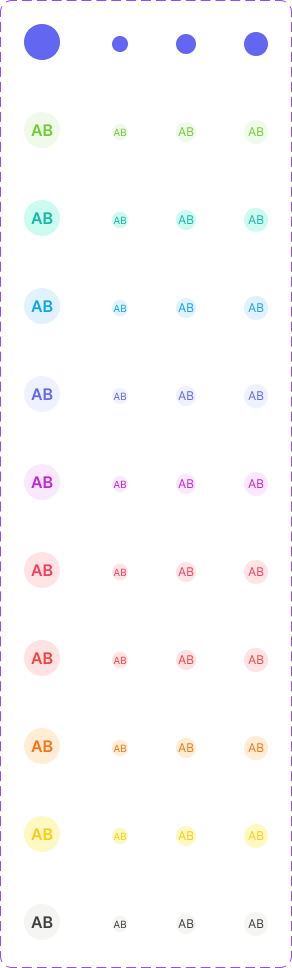
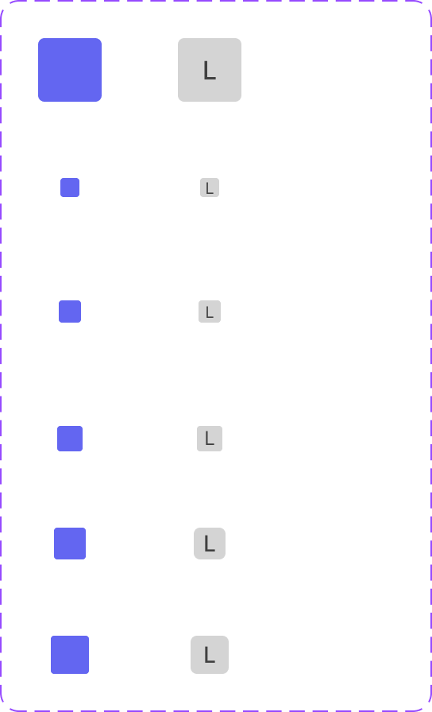

# Avatar

Circular or square badge representing a user, company, or generic entity — either a photo, a low-contrast color badge with initials, or (in the `Square` variant) a plain-letter fallback.

Figma: [`✅ Avatar`](https://www.figma.com/design/YFci6zgeYAQqX2OlHKQB0e) page. Tokens referenced below are defined in [`../DESIGN.md`](../DESIGN.md) — this doc never repeats raw values, only token names.

## Spec

Measured from Figma on 2026-10-06; Figma was tidied to match where noted in the Changelog. Where this section and the sections below disagree, this section is right.

Coded in [`components/src/avatar/`](../../../components/src/avatar/) (`Avatar` for the round one, `SquareAvatar` for `Square`).

**`Avatar` (round)**

Always a full circle (`border-radii/rounded-infinite`), no border. Two styles: `Picture` (a photo filling the circle) and `Low contrast letter` (initials on a tinted fill; colors in the table further down).

| `Size` | Diameter | Initials text style |
|---|---|---|
| `36px` | 36px | `Body/Medium-semibold` |
| `24px` | 24px | `Support/Caption` |
| `20px` | 20px | `Support/Caption` |
| `16px` | 16px | `Body/Tiny-regular` |

**`Square`**

No border. `Picture` is a photo; `Initials` is one letter in `text + icon/secondary` on `bg/tertiary`.

| `Size` | Box | Corner radius | Initial text style |
|---|---|---|---|
| `40px` | 40px | `border-radii/rounded-4` | `Body/Medium-medium` |
| `24px` | 24px | `border-radii/rounded-4` | `Body/Small-medium` |
| `20px` | 20px | `border-radii/rounded-4` | `Body/Small-medium` |
| `16px` | 16px | `border-radii/rounded-2` | `Support/Caption` |
| `14px` | 14px | `border-radii/rounded-2` | `Body/Tiny-regular` |
| `12px` | 12px | `border-radii/rounded-2` | `Body/Tiny-regular` |

## Variant families

Two distinct component sets live on this page — they are not interchangeable and are not sized the same:

| | `Avatar` | `Square` |
|---|---|---|
| Shape | Circular (`border-radii/rounded-infinite`) | Square with small corner radius |
| Styles | `Picture` (photo), `Low contrast letter` (color + initials) | `Picture`, `Initials` |
| Sizes | 36px, 24px, 20px, 16px | 40px, 24px, 20px, 16px, 14px, 12px |

Do not assume a size available on one exists on the other — `Avatar` no longer has 12px/14px (see Changelog below), `Square` still does.

## `Avatar` — Low contrast letter colors

Each color name binds to a background + text token pair. Most are decorative, but **two are not** — worth knowing before treating this like a purely-arbitrary color picker:

| Color name | Background token | Text token | Meaning |
|---|---|---|---|
| Green | `bg/success-subtle` | `text + icon/success` | **Semantic** — reuses the success status color, not decorative |
| Red | `bg/danger-subtle` | `text + icon/danger` | **Semantic** — reuses the danger status color, not decorative |
| Blue | `bg/accent-indigo-subtlest` | `text + icon/accent-indigo` | Brand/interactive indigo, not a generic "blue" accent |
| Teal | `bg/accent-teal` | `text + icon/accent-teal` | Decorative |
| Sky | `bg/accent-sky` | `text + icon/accent-sky` | Decorative |
| Purple | `bg/accent-fuchsia` | `text + icon/accent-fuchsia` | Decorative (name says Purple, token family is fuchsia) |
| Pink | `bg/accent-blush` | `text + icon/accent-blush` | Decorative (name says Pink, token family is blush) |
| Orange | `bg/accent-peach` | `text + icon/accent-peach` | Decorative |
| Yellow | `bg/accent-sun` | `text + icon/accent-sun` | Decorative |
| Gray | `bg/accent-stone` | `text + icon/secondary` | Decorative background, but text intentionally uses the neutral secondary color rather than `accent-stone`'s own text token — better contrast against the near-white background |

**Implication:** if you're picking an avatar color for a new user/entity, `Green` and `Red` are not neutral choices — they'll visually read as "success" and "danger" states to anyone who's learned the rest of the system. Prefer the other 8 for pure visual variety.

## Sizing tokens

- Circularity: all `Avatar`-frame containers bind `cornerRadius` to `border-radii/rounded-infinite`, not a fixed pixel value — guarantees a perfect circle at any size.
- No ring or stroke on either component.
- `Square`'s small sizes (12px, 14px, 16px) use `border-radii/rounded-2`; the larger sizes use `border-radii/rounded-4`.

## Text style

Avatar initials ("AB") use `Body/Tiny-regular` (10px, Inter Regular) at the 16px avatar size — a style created specifically for this component (see DESIGN.md changelog). `Square`'s Initials variants use `Support/Caption` (12px) — already correct, no relation to the above.

## Known gaps

None open.

## Changelog

- **2026-10-06:** added the Spec section. In Figma: renamed the round Avatar's `Size=40px` to `Size=36px` (it has always measured 36px); rebound the picture placeholder fill from `text + icon/accent-indigo` to `bg/accent-indigo` on both components (no visual change); deleted two broken leftover variants after confirming zero live instances in the file — round `Size=12px` (Green only, unstyled 8px text) and Square `Size=14px, Type=Initials hover` (actually 40px, still bound to foreign-library colors). Corrected this doc: there is no 1px ring. `Square`: the 2px corners on its 12px, 14px and 16px sizes are bound to the new Foundations primitive `border-radii/rounded-2`, and the 12px and 14px initials now use `Body/Tiny-regular` (the 12px one was an unstyled 8px, so its letter is slightly larger). First coded versions of `Avatar` and `SquareAvatar` added.
- **Removed 12px/14px from `Avatar`, kept on `Square`.** Cross-checked against a real in-app component (Request card, node `2424:18298`) and confirmed 16px is the size actually specified. Before deletion, audited all 40 small-size variants across every page: found 55 live instances of `Avatar`-frame 12px/14px (Table: 4, Request list: 27, Activity log: 24), all migrated to the matching 16px color variant via component swap, verified via async main-component resolution (the synchronous `mainComponent` property proved unreliable on deeply-nested instances during this migration — resolve via `getMainComponentAsync()` for any future bulk swap work). `Square`'s 12px/14px were separately confirmed in active use (47 instances) and were explicitly out of scope for removal.
- **Created `Body/Tiny-regular`** to formalize the previously-unbound 10px/Regular text used by the 16px avatar's initials.
- Fixed 3 unbound colors, 73 corner-radius bindings, and 159 stroke-weight bindings across both variant families to reference Foundation primitives instead of raw values.
- Added granular Figma annotations pinned to specific elements: `Avatar` frame root (circularity rule + the 12px/14px removal, warning against reintroducing without checking usage), `Green`/`Red` swatches (semantic-not-decorative warning), `Gray` swatch (the text-token deviation), `Square` frame root (distinct from `Avatar`, sizes not in parity). Visible directly in Figma (Design or Dev mode) in addition to this doc.
