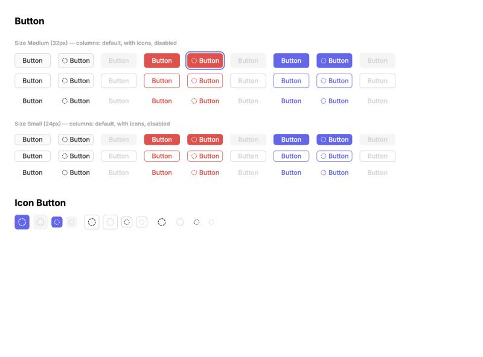

# Button

The most reused component in the system — 144 variants covering hierarchy, accent, size, state, and inverted-surface combinations, plus a 24-variant icon-only sibling and a responsive button-group wrapper.

Figma: [`✅ Buttons`](https://www.figma.com/design/YFci6zgeYAQqX2OlHKQB0e) page. Tokens referenced below are defined in [`../DESIGN.md`](../DESIGN.md).

## Spec

Measured from Figma on 2026-10-05, then normalised with the design owner: resting and hover colors are as drawn; **focus and disabled each follow one rule** (they previously differed per variant). Figma was updated to match. Where this section and the sections below disagree, this section is right. Covers the normal (non-inverted) buttons only — see Known gaps for `Inverted?`.

Coded in [`components/src/button/`](../../../components/src/button/) (`Button`, `IconButton`).

**Size and shape** (`Button/Button`)

| | `Size=Small` | `Size=Medium` |
|---|---|---|
| Height | 24px | 32px |
| Horizontal padding | `spacing/2` (8px) | `spacing/2` (8px) |
| Gap between icon and label | `spacing/1` (4px) | `spacing/1` (4px) |
| Radius | `border-radii/rounded-6` | `border-radii/rounded-6` |
| Label | `Body/Small-medium`, one line | `Body/Small-medium`, one line |
| Prefix / suffix icon | 14px, same color as the label | 14px, same color as the label |
| Width | hugs its content | hugs its content |

**Resting and hover**

| Hierarchy | Accent | Fill | Border (`border-width/xs`) | Label and icon | Hover fill |
|---|---|---|---|---|---|
| Primary | Default | `bg/secondary` | `border/primary` | `text + icon/secondary` | `bg/primary-hover` |
| Primary | Danger | `bg/danger` | none | `text + icon/primary-inverse` | `bg/danger-bolder` |
| Primary | Blue | `bg/accent-indigo` | none | `text + icon/primary-inverse` | `bg/accent-indigo-bolder` |
| Outline | Default | none | `border/primary` | `text + icon/secondary` | `bg/primary-hover` |
| Outline | Danger | none | `border/danger` | `text + icon/danger` | `bg/danger-subtle` |
| Outline | Blue | none | `border/accent-indigo` | `text + icon/accent-indigo` | `bg/accent-indigo-subtlest` |
| Ghost | Default | none | none | `text + icon/secondary` | `bg/primary-hover` |
| Ghost | Danger | none | none | `text + icon/danger` | `bg/danger-subtle` |
| Ghost | Blue | none | none | `text + icon/accent-indigo` | `bg/accent-indigo-subtlest` |

Only the fill changes on hover; border and label stay as they are at rest.

**Focus — one rule for every button:** the button keeps its resting colors and gains a `border-width/sm` (2px) `border/accent-indigo` ring, 2px outside the button's edge, with `border-radii/rounded-10` corners. Shown for keyboard focus only. In Figma this is the `Focus ring` layer on each `State=Focus` variant.

**Disabled — one rule per hierarchy, whatever the accent:** label and icon are `text + icon/disabled`, and there is no hover.

| Hierarchy | Fill | Border |
|---|---|---|
| Primary | `bg/disabled` | none |
| Outline | none | `border/primary` |
| Ghost | none | none |

**`IconButton/Icon Button`** — a square button holding one icon, `border-radii/rounded-6`. It has no `Accent`.

| | `Size=24px` | `Size=32px` |
|---|---|---|
| Box | 24×24px | 32×32px |
| Icon | 14px | 20px |

| Style | Fill | Border | Icon | Hover fill | Disabled |
|---|---|---|---|---|---|
| Primary | `bg/accent-indigo` | none | `text + icon/primary-inverse` | `bg/accent-indigo-bolder` | fill `bg/disabled`, icon `text + icon/disabled` |
| Outline | `bg/primary` | `border/primary` | `text + icon/secondary` | `bg/primary-hover` | icon `text + icon/disabled` |
| Ghost | none | none | `text + icon/secondary` | `bg/primary-hover` | icon `text + icon/disabled` |

Focus is the same ring as Button.

**`Group Buttons`** — `Type=Horizontal`: buttons in a row, `spacing/3` (12px) apart, the group right-aligned in a bar padded `spacing/2` (8px) top/bottom and `spacing/4` (16px) left/right. `Type=Vertical`: buttons stacked 12px apart, each filling the width, same padding.

## Variant properties

**`Button/Button`** (144 variants): `Hierarchy` (Primary / Outline / Ghost) × `Accent` (Default / Danger / Blue) × `Size` (Small / Medium) × `State` (Default / Hover / Disabled / Focus) × `Inverted?` (False / True). Plus non-variant properties: `Prefix Icon` / `Suffix icon` (boolean toggles), `Prefix icon type` / `Suffix icon type` (instance-swap), `Button Text`, `ShortcutHelper?` + `ShortcutValue` (the trailing `⌘O`-style hint).

**`IconButton/Icon Button`** (24 variants): `Style` (Primary / Outline / Ghost) × `State` (Default / Hover / Disable / Focus) × `Size` (32px / 24px).

**`Group Buttons`** (2 variants): `Type` (Horizontal / Vertical) × `Tertiary button?` (boolean). See "Button groups" below — this is the responsive 2-or-3-button cluster, distinct from Bottom sheet's own mobile-specific button rules.

Note: **"Danger" and "destructive" are the same thing** — this file's `Accent=Danger` is what other component docs (e.g. Bottom sheet) call the destructive variant.

## When to use each Hierarchy

- **Primary** — the one main action on a screen/section. Solid fill.
- **Outline** — secondary action, or a primary action in a context that already has a Primary button nearby (e.g. Cancel next to Save).
- **Ghost** — lowest-emphasis action, no border/fill until hovered. Used as the optional third ("tertiary") action in button groups.

## Anatomy & tokens by Accent

Each `Accent` drives a full set of role tokens, not just the background:

| Role | Default | Danger | Blue |
|---|---|---|---|
| Primary fill | `bg/secondary` with a `border/primary` border / `bg/primary-hover` (hover) | `bg/danger` / `bg/danger-bolder` (hover) | `bg/accent-indigo` / `bg/accent-indigo-bolder` (hover) |
| Text/icon (on fill) | `text+icon/secondary` | `text+icon/primary-inverse` | `text+icon/primary-inverse` |
| Outline border/text | `border/primary`, `text+icon/secondary` | `border/danger`, `text+icon/danger` | `border/accent-indigo`, `text+icon/accent-indigo` |
| Focus ring | `border/accent-indigo` | `border/accent-indigo` | `border/accent-indigo` |
| Separator (the `\|` before a shortcut hint) | `border/primary-subtle` | `border/accent-blush` | `border/accent-sky` |
| Shortcut hint text (e.g. `⌘O`) | `text+icon/tertiary` | `text+icon/accent-blush` | `text+icon/accent-indigo-subtle` |

The Separator/Shortcut mapping is a deliberate, narrow exception to "accent colors are decorative" (see DESIGN.md §2.2) — `accent-blush`/`accent-sky` are reused here specifically to tint the shortcut-hint UI to match the button's Accent, not because blush/sky carry meaning on their own.

**Focus ring note:** regardless of a button's own Accent, the focus-visible ring is always `border/accent-indigo` — focus is a UI-state, not a content-accent, and stays consistent.

## Button groups (`Group Buttons`)

This component is the **desktop** pattern — a horizontal or vertical cluster of up to 3 buttons (Primary + Outline + optional Ghost via `Tertiary button?`), used for things like a sticky action bar at the bottom of a form.

- **Horizontal, 2 buttons:** Outline (left) + Primary (right).
- **Horizontal, 3 buttons (`Tertiary button?`=true):** Ghost (left) + Outline (middle) + Primary (right).
- **Vertical, 2 buttons:** Primary (top) + Outline (below).
- **Vertical, 3 buttons:** Primary (top) + Outline (middle) + Ghost (bottom).
- **Up to 4 buttons:** not a single component — compose a standalone Ghost/Outline `Button` instance aligned left (e.g. "< Back") next to a `Group Buttons` cluster aligned right. Example: `< Back` ⋯⋯⋯ `Cancel` `Save` `Next`.

**This is a desktop pattern, not the mobile Bottom Sheet rule.** Bottom Sheet's "always vertical for 3 CTAs" rule (see `bottom-sheet.md`) is specific to its narrow mobile container — it does not use this `Group Buttons` component at all (confirmed: Bottom Sheet's button row is an ad-hoc 2-button frame, not an instance of this component). On wider/desktop layouts, horizontal 3-up is the correct, already-built pattern.

## Known gaps

- **`Inverted?=True` (72 variants) is not specified or coded yet.** These variants are the least consistent part of the component — several use a text token as a border or fill, or `bg/primary` as a text color — and were deliberately left untouched in Figma on 2026-10-05. They need their own rule table before a screen uses one.
- **The shortcut hint (`ShortcutHelper?`) is not coded yet** — its text style is an unbound, off-scale style in Figma.

- **Adaptive subtle overlay (16 instances) — resolved 2026-08-20:** a very low-opacity black (4%) used as both a barely-visible edge stroke on solid buttons and a hover-fill tint on outline/ghost buttons. Previously described here as "left unbound," but was actually bound to a variable named `transparent/light` that had since been **deleted from the file's active variable collection** — an orphaned reference invisible in Figma's own Variables panel (`getLocalVariablesAsync` no longer lists it) yet still resolvable via its old ID, so the 16 instances kept rendering correctly while silently pointing at nothing real. Discovered while auditing [Approve & Reject dialog](request-detail-approve-reject-dialog.md) and confirmed file-wide on this page. At the user's request, cleared all 16 dangling bindings and set the same `rgba(0,0,0,0.04)` as a static (unbound) color — visually identical, no more orphaned reference. The underlying gap remains real: our token system still has no equivalent "adaptive overlay" utility that would correctly invert to a light tint on `Inverted?=True` surfaces (this fix keeps the value fixed-black, matching the original's actual behavior, which also had no such adaptation — confirmed via a single-mode variable value, not a genuine light/dark pair). Worth considering as a future Foundation primitive if this pattern recurs.
- **Icon internal vector stroke (24 instances, 1.1px):** same pattern seen in every other component so far — icon glyph strokes don't align to the `border-width` scale (only `xs`=1px exists). Left unbound.

## Changelog

- **2026-10-05:** added the Spec section and normalised the component with the design owner, in Figma and in code. (1) **Focus:** all 18 normal `Button` Focus variants and all 6 `Icon Button` Focus variants now keep their resting colors and carry a `Focus ring` layer; previously focus was an indigo tint on some, a white inner ring on others, and a bare fill change on the rest. (2) **Disabled:** all 18 normal Disabled variants follow one rule per hierarchy. (3) Removed the static 4% black edge stroke from the normal filled variants (see the 2026-08-20 entry; it remains on inverted variants). (4) Renamed the variant property `Hierachy` → `Hierarchy`. (5) Corrected this doc's anatomy table, which described the Default-accent Primary button as a dark fill with inverse text; it is `bg/secondary` with `text + icon/secondary`. First coded version added in `components/src/button/`. (6) The `Focus ring` layer's width is bound to the new Foundations primitive `border-width/sm` (2px) and its radius to `border-radii/rounded-10`.

- **2026-08-20:** cleaned up 16 dangling `transparent/light` variable bindings (see Known gaps for the full orphaned-variable story) — discovered while auditing a moved Request list component, traced back to this shared page. Fixed on the actual master components, so every Button instance across the file benefits. Verified visually before/after on the specific Danger/Medium/Default variant and the downstream [Approve & Reject dialog](request-detail-approve-reject-dialog.md) — pixel-identical, no rendering changes.
- **994 color properties audited** across all 170 variants (144 Button + 24 IconButton + 2 Group Buttons). This was overwhelmingly bound to a **different, deprecated design system's tokens** (`palette-deprecated/*`, `adaptive-colors-deprecated/*`, `accent-depreciated/*`, plus generic names like `transparent/light`, `grays/40`) — not just unbound, actually wrong-library-bound. 242 foreign bindings identified and remapped to Portal 2.0 tokens (see table above); 16 left unbound as a genuine capability gap (see Known gaps).
- Found and fixed 2 orphaned references to this file's own **pre-rename** tokens (`border/brand`, `text + icon/brand`, both `#4450f7`) — same pattern as the Color page's early orphaned-variable fixes, just not caught until this pass. Rebound to `border/accent-indigo` / `text + icon/accent-indigo`.
- Found a mislabeled token (`borders/danger`, used on text fills despite its name) — confirmed with the design owner it should be `text + icon/primary-inverse`, not a danger-family token at all. Fixed 29 instances.
- Fixed 320 corner-radius, 97 stroke-weight, 794 spacing bindings to Foundation primitives. The `cornerRadius=56` pattern (144 instances) was the same "arbitrarily large value to force full rounding" pattern seen in Avatar — rebound to `border-radii/rounded-infinite`.
- Fixed 312 unbound white fills on the default placeholder icon (`icon/circle-dashed`, shown when no prefix/suffix icon is chosen) to `bg/primary` — same non-issue pattern as other components' placeholder defaults.
- Documented the `Group Buttons` component's existing Horizontal/Vertical/Tertiary behavior, and clarified its relationship to (and separation from) Bottom Sheet's mobile-specific button rules.
