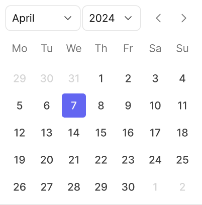
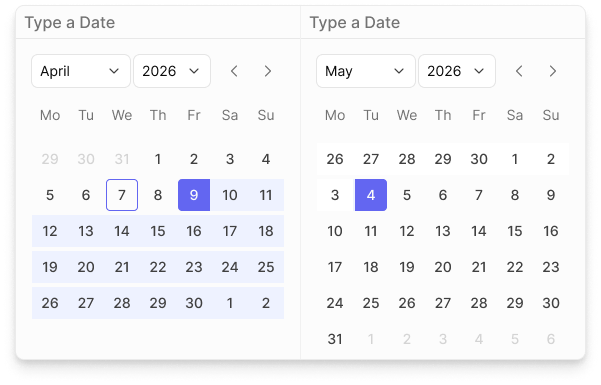

# Calendar

Single-month date picker used across the platform for selecting one date or a date range. Built from four sub-components — Calendar Header, Day of Week, Date States (day cell), and CalendarBody (the assembled matrix) — that combine into the simple single-month calendar shown below, which is the pattern actually used on the platform today.

Figma: [`✅ Calendar`](https://www.figma.com/design/YFci6zgeYAQqX2OlHKQB0e) page. Tokens referenced below are defined in [`../DESIGN.md`](../DESIGN.md).

## Spec

Measured from Figma on 2026-10-06, then tidied with the design owner; Figma was updated to match. Where this section and the sections below disagree, this section is right.

Coded in [`components/src/calendar/Calendar.tsx`](../../../components/src/calendar/Calendar.tsx) (`Calendar`, with `mode="single"` or `mode="range"`).

**Layout** (`CalendarBody`, one month)

| Part | Value |
|---|---|
| Body | 268px wide, padding `spacing/2` (8px), `spacing/2` (8px) between header, weekday row and weeks |
| Header | 32px high. Left: month [Dropdown](dropdown.md) (98px) and year Dropdown (76px), `spacing/1` (4px) apart, no label or hint. Right: previous and next 32px Ghost [Icon Buttons](button.md), `spacing/0,5` (2px) apart, icons `text + icon/tertiary` |
| Weekday row | 7 cells of 36×32px, two-letter labels (Mo, Tu, …) in `Body/Small-regular`, `text + icon/tertiary`, centered |
| Weeks | always 6 rows of 7 day cells, rows `spacing/1` (4px) apart, no gap between cells in a row |
| Card (when floating) | fill `bg/primary`, border `border/primary-subtle`, `border-radii/rounded-8`, effect `shadow-lg` — the same panel style as [Menu](menu-item.md) |

**Day cell** (`Date States`) — 36×32px, with a 32×32px pill centered inside it. The number is `Body/Small-medium`.

| Cell | Pill fill | Number | Shape |
|---|---|---|---|
| Regular | none | `text + icon/secondary` | — |
| Hover | `bg/accent-indigo-subtlest` | `text + icon/accent-indigo` | `border-radii/rounded-4` |
| Disabled, or a day from the previous or next month | none | `text + icon/disabled` | — |
| Today, not selected | none, with a 1px `border/accent-indigo` outline | `text + icon/secondary` | `border-radii/rounded-4` |
| Selected (single date, or today when selected) | `bg/accent-indigo` | `text + icon/primary-inverse` | `border-radii/rounded-4` |
| Range start | `bg/accent-indigo` | `text + icon/primary-inverse` | rounded on the left only; the right half of the cell behind it is `bg/accent-indigo-subtlest` |
| Range end | `bg/accent-indigo` | `text + icon/primary-inverse` | rounded on the right only; the left half of the cell behind it is `bg/accent-indigo-subtlest` |
| In range | the whole 36px cell is `bg/accent-indigo-subtlest`, square corners | `text + icon/secondary` | forms one continuous band with its neighbours |
| In range, in an adjacent month | as "In range", faded by a 54% `bg/primary` overlay | `text + icon/secondary` | — |
| Focus | as Regular, plus the system-wide focus ring around the pill (2px `border/accent-indigo`, 2px outside, `border-radii/rounded-8`) | | |

## Anatomy

The assembled calendar (`CalendarBody`) stacks, top to bottom: **Calendar Header** → **Day of Week** row → 6-row grid of **Date States** day cells. On the platform, that assembly sits inside an outer card frame (the "Light Mode" wrapper in the Example section) that owns the actual visible card chrome — `CalendarBody` itself renders edge-to-edge with no radius of its own.

| Part | Token(s) |
|---|---|
| Outer card — fill, border, radius | `bg/primary`, `border/primary-subtle`, `border-width/xs`, `border-radii/rounded-8` |
| Header/body divider — bottom edge of `CalendarBody` only (not a full border) | `border/primary-subtle`, `border-width/xs` |
| Card padding / row-to-row gap | `spacing/2` (8px) |
| Month/year dropdown label | `text + icon/primary`, `Body/Small-regular` |
| Nav chevrons (prev/next month) | `text + icon/tertiary` |
| Weekday header labels (Mo, Tu, …) | `text + icon/tertiary`, `Body/Small-regular` |
| Day cell — default number | `text + icon/secondary`, `Body/Small-medium` |
| Day cell — disabled / outside allowed range | `text + icon/disabled` |
| Day cell — hover | `bg/accent-indigo-subtlest` fill, `text + icon/accent-indigo` number, `border-radii/rounded-4` |
| Day cell — selected / range start / range end | `bg/accent-indigo` fill, `text + icon/primary-inverse` text, `border-radii/rounded-4` (start rounds left corners only, end rounds right corners only — square where they meet an adjacent in-range day) |
| Day cell — in selection (same month) | `bg/accent-indigo-subtlest` fill, flat corners (no radius — forms a continuous strip) |
| Day cell — in selection (adjacent month, shown for context) | Same `bg/accent-indigo-subtlest` fill, additionally faded via a ~54% white overlay to de-emphasize vs. the current month |
| Day cell — today (not selected) | White fill, `border/accent-indigo` outline, `border-width/xs`, `border-radii/rounded-4`, `text + icon/secondary` text |
| Day cell — today + selected | Same as selected (solid `bg/accent-indigo`) — today's ring is not shown once selected |

### Sub-components

- **Calendar Header** (`121:2710`) — variants: `Type` = `Default` (month + year dropdowns only) / `DateTime` (adds a time input field), `State` = `Active` / `Disable`.
- **Day of Week** (`121:2651`) — variant: `Week starts on` = `Monday` / `Sunday`, reorders the 7 weekday labels.
- **Date States** (`121:2669`) — the day-cell component set; 9 authored combinations of `Type` (`Basic`/`Selected`/`Today`) × `State` (`Regular`/`Hover`/`Disabled`/`Start`/`In selection`/`In selection (another month)`/`End`) × `Selected` (`True`/`False`). Not a full cross-product — only the combinations actually needed are built.
- **CalendarBody** (`121:2747`) — assembles the above into the full card. Variants: `Edit` (interactive — header controls and day cells respond to input) / `Read-Only` (display-only, same visual treatment).

## Behavior rules

- **Selection model:** a single day cell can be Regular, Hover, Disabled, Selected (start/end/today), or part of an in-range selection. Range selection is expressed with dedicated `Start` and `End` states (solid fill, corners rounded only on the outer edge) plus an `In selection` state for days between them (flat, no corner rounding — reads as one continuous bar).
- **Cross-month context in a range:** when a selected range spans into the leading/trailing days of an adjacent month (the grayed-out dates at the start/end of the grid), those in-range cells reuse the `In selection` fill but at reduced opacity, keeping the range visually continuous while still reading as "not really this month."
- **Today indicator:** an unselected "today" is marked with an indigo outline ring rather than a fill, so it's distinguishable from an actual selection at a glance. Once today is also the selected date, it collapses to the normal solid-fill selected treatment — the ring is selection-specific, not a permanent badge.
- **Week start is configurable** (`Monday` or `Sunday`) via the Day of Week component — pick per locale/product convention, not per-instance preference.
- **Composing multi-month patterns:** the DS also includes several *usage examples*, not separate components, built by placing two `CalendarBody` instances side by side and letting the shared selection state (Start/In selection/End) span across them: a dual date-input range picker, a plain double-month view, and a range picker with a preset sidebar (Today / Last 7 days / Last 30 days / Last 90 days / past years). Reach for these compositions when a flow needs range selection; the single calendar remains the default for single-date input.

**Proposed, not yet confirmed with the design owner** — flagging rather than asserting as fact:
- `CalendarBody`'s `Edit` vs `Read-Only` variants render visually identically in the current file; the assumed distinction is that `Read-Only` disables interaction (no hover/click response) rather than changing appearance. Worth confirming before treating this as documented behavior.
- Whether the sidebar-preset pattern's preset list (year entries specifically) is meant to be dynamic (always "current year and back") vs. a fixed list.

## Known gaps (component doesn't yet match spec, or naming is inconsistent)

- **Not coded yet:** the `DateTime` header (with a time field), the two-month layouts and the preset sidebar, and the faded "in range, adjacent month" cell (days outside the shown month are simply disabled in code).

- **No explicit "Today, Regular, Selected=False" cell exists** as its own combination — the only "Today" variants are Today+Selected and the Today+"Disabled" one described above. If a future need arises for today to render distinctly while also being hoverable/interactive, this gap will need a new variant.
- Day-cell pill padding/spacing (20/20/13/13/10px on the inner `Frame 3813` wrapper) doesn't cleanly map to the `spacing/*` primitive scale (13px isn't a defined step) and the wrapper is fixed-size, so this padding may be vestigial rather than actually driving layout — left unbound rather than force-fit to an incorrect token.
- Nested instances inside Calendar Header (Dropdown selection, time Input field, chevron icons) carry their own unbound geometry (padding, stroke weight) — out of scope here since they belong to the Dropdown and Text Input components, which haven't been audited yet themselves.
- No dark-mode variant exists for Calendar, consistent with the rest of the file (dark-mode token values exist per §5 note in `DESIGN.md`, but no component has a built dark-mode variant yet).

## Changelog

- **2026-10-06:** added the Spec section and tidied with the design owner. In Figma: the range Start/End connector strip (a raw blue at 8%) and the white underlay of the in-range cells are bound to `bg/accent-indigo-subtlest` and `bg/primary`; today's outline is bound to `border/accent-indigo` instead of a text token; the misnamed `Type=Today, State=Disabled, Selected=False` is renamed `State=Regular`; a `Type=Basic, State=Focus` day cell is added with the system-wide focus ring; the calendar card's custom shadow is replaced with the `shadow-lg` effect style on the three example cards. Corrected this doc: day numbers are `Body/Small-medium` in `text + icon/secondary`, today's number is not indigo, and the nav chevrons are `text + icon/tertiary`. First coded version added (single date and range, one month).
- Fixed `CalendarBody`'s bottom divider — all instances (`Edit` and `Read-Only`) were bound to a stray `Borders/Light` variable imported from an unrelated/deprecated library (key prefix `b638e62f83d6d07138a5e8abfc60e1df4c208c20`, not this file's semantic collection) rather than `border/primary-subtle`. Same "Twenty library leftover" pattern seen in prior components.
- Bound the selected/today/hover day-cell pill's corner radius (previously a raw `4`) to `border-radii/rounded-4` — including the asymmetric per-corner binding on the `Start`/`End` range variants (rounded only on the outer edge).
- Bound `CalendarBody`'s card padding and row gap (previously raw `8`) to `spacing/2`.
- Bound `Calendar Header`'s internal gap between the month/year dropdowns and the nav chevrons (previously raw `8`) to `spacing/2`.
- **Follow-up pass — border-width and corner-radius were incomplete on the first audit:**
  - Found the actual visible outer card (the "Light Mode" wrapper frame, not `CalendarBody`) was bound to two more stray foreign-library variables — fill `Transparent/Secondary` → rebound to `bg/primary`, stroke `Borders/Medium` → rebound to `border/primary-subtle`. Same bug class as the `Borders/Light` fix above, just missed on the first pass because it lives one level up from `CalendarBody`.
  - Bound the outer card's corner radius (previously a raw `8`) to `border-radii/rounded-8`, and its border width (previously a raw `1`) to `border-width/xs`.
  - Bound `CalendarBody`'s bottom-divider stroke width (previously a raw `1`) to `border-width/xs`.
  - Bound the unselected-today ring's corner radius (raw `4`) and border width (raw `1`) to `border-radii/rounded-4` / `border-width/xs`, on the main `Date States` component — confirmed the nested instance inside `CalendarBody`'s grid inherits this automatically (no separate override existed).
  - Corrected this doc's Anatomy table, which had wrongly attributed the card's radius/border to `CalendarBody` (`border-radii/rounded-6`) — the real values live on the outer wrapper and are `rounded-8`.
  - Deleted 3 hidden (`visible: false`) dead layers from the outer card wrapper — `MenuComponents/Dropdown Header`, `FloatingInput/Components/Header/Calendar Input`, `Frame 4333` — leftover from an unrelated composition. Confirmed via screenshot before/after that removal caused no visual change (they weren't rendering). Scoped to this one example instance, not shared main components, so no cross-page usage check was needed.
- Documented the selection/range/today/hover model and the multi-month composition patterns — sourced from visual inspection of the DS's own "Example" section, not previously written down.
- Left several sizing values unbound with rationale (see Known gaps) rather than force-fitting to a token that doesn't actually match.
