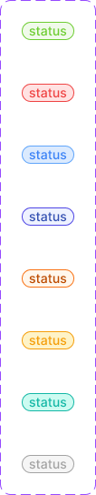
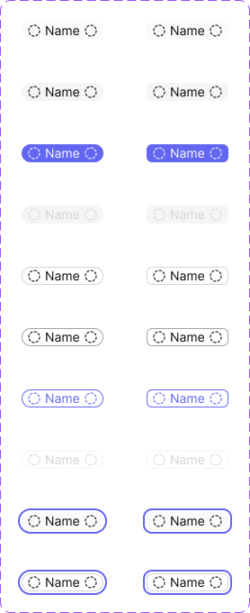

# Chips/Tag & Badge

Two related small-pill components documented together because they share one Figma page: **Badge** (static status indicator) and **Chips/Tag** (interactive, selectable filter pill).

Figma: [`✅ Chips/Tag & Badge`](https://www.figma.com/design/YFci6zgeYAQqX2OlHKQB0e) page. Tokens referenced below are defined in [`../DESIGN.md`](../DESIGN.md).

## Spec

Measured from Figma on 2026-10-05/06, then tidied with the design owner; Figma was updated to match. Where this section and the sections below disagree, this section is right.

Coded in [`components/src/badge/`](../../../components/src/badge/) (`Badge`, `Chip`).

**Badge**

| Property | Value |
|---|---|
| Height | 20px (hugs the label's line height; no vertical padding) |
| Horizontal padding | `spacing/2` (8px) each side |
| Gap between icon and label | `spacing/1` (4px) |
| Radius | `border-radii/rounded-infinite` — always a full pill |
| Border | `border-width/xs` (1px), always present |
| Label | `Body/Small-medium`, one line |

Every state has a fill, a border **and** a text color, all from one status family:

| State | Fill | Border | Text and icon |
|---|---|---|---|
| `Success` | `bg/success-subtle` | `border/success` | `text + icon/success` |
| `Error` | `bg/danger-subtle` | `border/danger` | `text + icon/danger` |
| `Info` | `bg/info-subtle` | `border/info` | `text + icon/info` |
| `Accent` | `bg/accent-indigo-subtlest` | `border/accent-indigo-bolder` | `text + icon/accent-indigo` |
| `Urgent` | `bg/urgent-subtle` | `border/urgent` | `text + icon/urgent` |
| `Warning` | `bg/warning-subtle` | `border/warning` | `text + icon/warning` |
| `Idle` | `bg/idle-subtle` | `border/idle` | `text + icon/idle` |
| `Disabled` | `bg/disabled` | `border/primary-bolder` | `text + icon/tertiary` |

**Chips/Tag**

| Property | Value |
|---|---|
| Height | 20px |
| Horizontal padding | `spacing/1,5` (6px) each side, on both hierarchies |
| Gap between icons and label | `spacing/1` (4px) |
| Radius | `Roundness=True`: `border-radii/rounded-infinite` · `Roundness=False`: `border-radii/rounded-6` |
| Label | `Body/Small-regular`, one line |
| Prefix / suffix icon | 16px, same color as the label |

| State | `Hierarchy=Primary` (filled, no border) | `Hierarchy=Secondary` (outlined, `border-width/xs`) |
|---|---|---|
| `Deselected` | fill `bg/secondary`, label `text + icon/primary` | fill `bg/primary`, border `border/primary`, label `text + icon/primary` |
| `Hover` | fill `bg/primary-hover` | border `border/primary-bolder` (fill unchanged) |
| `Selected` | fill `bg/accent-indigo`, label `text + icon/primary-inverse` | border `border/accent-indigo`, label `text + icon/accent-indigo` (fill unchanged) |
| `Disabled` | fill `bg/disabled`, label and icons `text + icon/disabled` | no fill, border `border/disabled`, label and icons `text + icon/disabled` |
| `Focus` | as `Deselected`, plus the system-wide focus ring (2px `border/accent-indigo`, 2px outside) | same |

## Badge

Non-interactive status label — a pill with a tinted fill, border and text all from one status family. Used for record status, priority, or category labels.

### Anatomy

| Part | Token(s) |
|---|---|
| Fill | `bg/<status>-subtle` (e.g. `bg/success-subtle`), present on every state — see Spec |
| Border | `border/<status>` or `border/<status>-bolder`, `border-width/xs` |
| Text | `text + icon/<status>`, `Body/Small-medium` |
| Shape | `border-radii/rounded-infinite` (full pill), padding `spacing/2` horizontal / `0` vertical, `spacing/1` gap (between icon and label, if present) |

### Variants

`State` = `Success` / `Error` / `Info` / `Accent` / `Urgent` / `Warning` / `Idle` / `Disabled`.

| State | Text/border token |
|---|---|
| Success | `text + icon/success` / `border/success` |
| Error | `text + icon/danger` / `border/danger` |
| Info | `text + icon/info` / `border/info` |
| Accent | `text + icon/accent-indigo` / `border/accent-indigo-bolder` |
| Urgent | `text + icon/urgent` / `border/urgent` |
| Warning | `text + icon/warning` / `border/warning` |
| Idle | `text + icon/idle` / `border/idle` |
| Disabled | `text + icon/tertiary` / `border/primary-bolder`, `bg/disabled` fill |

### Behavior rules

- **Content is short-form only** — a status word (`Success`) or a compact number/count (`2`). Not intended for multi-word labels; the pill hugs its content with no max-width or truncation defined.
- **Never interactive** — no hover/pressed states exist in the variant set (unlike Chips/Tag below), consistent with a badge being a display-only status marker, not a control.
- **Status colors follow the same family-pairing rule as the rest of the system** (§5 of `DESIGN.md`): text, border, and fill (where present) must come from the same status family — never mix, e.g. don't pair `text+icon/success` with `border/danger`.

## Chips/Tag

Interactive, selectable pill — used for filters, multi-select tags, and removable input tokens (e.g. "Alexandre Prot ✕").

### Anatomy

| Part | Token(s) |
|---|---|
| Fill (Deselected/Hover) | Primary: `bg/secondary` / `bg/primary-hover`. Secondary: `bg/primary` in both |
| Fill (Selected) | `bg/accent-indigo` |
| Fill (Disabled) | `bg/disabled` |
| Border (Secondary only) | `border/primary` (default), `border/primary-bolder` (hover), `border/accent-indigo` (selected), `border/disabled`, `border-width/xs` |
| Label | `text + icon/primary` (default/hover), `text + icon/primary-inverse` (on Selected's indigo fill), `text + icon/disabled`, `Body/Small-regular` |
| Prefix/suffix icon | Boolean-toggleable slots, `INSTANCE_SWAP` — default swaps to a placeholder icon; `text + icon/accent-indigo` tint when relevant |
| Shape (`Roundness=True`) | `border-radii/rounded-infinite` (full pill) |
| Shape (`Roundness=False`) | `border-radii/rounded-6` |
| Padding / icon-label gap | `spacing/1,5` (6px) horizontal padding on both hierarchies, `spacing/1` (4px) gap |

### Variants

`State` = `Deselected` / `Hover` / `Selected` / `Disabled`. `Hierarchy` = `Primary` / `Secondary`. `Roundness` = `True` (pill) / `False` (rounded-rect). 16 total combinations (all built — full cross-product, unlike Badge or Calendar's Date States).

- **Primary** — filled/borderless by default, reserved for the more visually prominent chip usage (e.g. a single active filter value).
- **Secondary** — always outlined (visible border in every state), lower visual weight — reserved for chip *lists* where many appear together (filter option lists, removable tag collections) and shouldn't compete for attention.

### Behavior rules

- **Selection is binary per chip** (Deselected ↔ Selected) — for filter UIs, whether multiple chips can be selected simultaneously is a product-level decision, not something the component enforces.
- **Prefix/suffix icons are optional per instance** (boolean toggles), commonly used for: a leading category icon, or a trailing ✕ to make the chip removable (as in the "Alexandre Prot ✕" example — a Secondary, non-pill chip representing a selected value that can be cleared).
- **Roundness is a deliberate per-usage choice, not a global setting** — pill (`Roundness=True`) reads as more "tag/filter-chip" like; rounded-rect (`Roundness=False`) reads slightly more like a compact button. Pick per context, both are fully supported across all states.
- **Hierarchy governs list vs. standalone usage** — default to `Secondary` when multiple chips appear together (filter rows, tag lists); reserve `Primary` for a single prominent chip (e.g. showing the one active filter value inline, as in the "Credit card" example).

## Known gaps (component doesn't yet match spec, or naming is inconsistent)

- **Cosmetic variable-name collision:** several corner-radius bindings across both components resolve to a remote variable Figma displays as `border-radii/rounded-infinite 2` (with a stray " 2" suffix) rather than `border-radii/rounded-infinite`. Confirmed by key that this **is** the correct Foundations primitive (value `9999`, same publish key as the canonical `rounded-infinite`) — the suffix is Figma disambiguating against some other remote-library variable that happens to share the unsuffixed display name. Not a binding bug (the value is correct), just a display artifact that can't be fixed by rebinding from this file. Worth a note if anyone renames/audits the colliding source library.
- Prefix/suffix icon internals (the Tabler icon vector's ~1.1px stroke weight) are left unbound — same precedent as Breadcrumb and Calendar's icon strokes (no exact Foundation match).

## Changelog

- **2026-10-06:** added the Spec section and tidied both components with the design owner, in Figma and in code. **Badge:** `Urgent`'s border rebound from a raw `#bd4b00` to `border/urgent`; `Idle`'s border rebound from the text token `text + icon/idle` to the new `border/idle` token (same teal). **Chips/Tag:** `Selected` Primary fill rebound from `text + icon/accent-indigo` to `bg/accent-indigo`, and disabled icon color from `border/primary` to `text + icon/disabled` (both no visual change); added 4 `State=Focus` variants carrying the system-wide focus ring. Corrected this doc, which said some Badge states had no fill and that the two chip hierarchies had different padding. First coded versions added in `components/src/badge/`.

- **Badge:** bound border width (previously raw `1`, unbound) to `border-width/xs` across all 8 `State` variants.
- **Badge — Urgent variant:** fixed the fill color, which was bound directly to a raw Tailwind color primitive (`Colors/Orange/4`, `#ffe8d7`) instead of the semantic `bg/urgent-subtle` token — same "reaching past the semantic layer" bug class as prior raw-primitive fixes, just at the primitive-color level rather than a foreign-library level. Verified no visible color shift after the fix.
- **Chips/Tag:** bound border width (previously raw `1`, unbound) to `border-width/xs` across all 8 `Hierarchy=Secondary` variants (the `Primary` variants already had this bound correctly).
- **Chips/Tag:** fixed 2 Label nodes (the `Deselected, Hierarchy=Primary` state, both `Roundness` values) bound to a foreign/deprecated `Text/Primary` token (`#333333`) instead of this system's `text + icon/primary` (`#0a0a0a`) — same "Twenty library leftover" pattern seen in Calendar and Breadcrumb.
- Confirmed padding, gap, corner-radius (aside from the cosmetic collision above), fills, strokes, and text styles are otherwise fully and correctly bound on both components — no further sizing gaps found.
- **User fix (2026-08-17):** renamed Chips/Tag's `Hierachy` variant property to `Hierarchy` across all 16 variants — typo corrected directly in Figma.
- **User fix (2026-08-17):** removed Badge's incomplete `Weight` variant property (previously stuck at a single `Medium` option) rather than building out a second value — Badge variants are now keyed on `State` alone.
- Documented anatomy, variants, and usage rules for both components — not previously written down.
