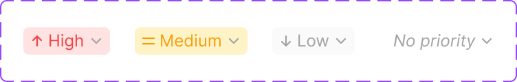

# Create Form / Priority

The priority-level control shown while creating a request — a dropdown selector plus supporting status-badge atoms used elsewhere the priority value is displayed (e.g. list/table rows).

Figma: [`📱 Create form`](https://www.figma.com/design/YFci6zgeYAQqX2OlHKQB0e) page, `Sticky button`, `Priority status`, `InlineCell/Status badge` components.

## Spec

Measured from the Figma component on 2026-10-05. Where this section and the tables below disagree, this section is right. Covers `Priority status`, the chip shown in the request table's Priority column and in the create form.

| Property | Value |
|---|---|
| Height | 20px |
| Horizontal padding | `spacing/1` (4px) each side |
| Gap between icon, label, chevron | `spacing/0,5` (2px) |
| Radius | `border-radii/rounded-4` |
| Border | none |
| Label | `Body/Mini-regular`, one line |
| Icons | 12px, leading level icon and trailing `icon/chevron-down` |

| Level | Fill | Leading icon | Icon + label color | Label style |
|---|---|---|---|---|
| `High` | `bg/danger-subtle` | `icon/arrow-up` | `text + icon/danger` | `Body/Mini-regular` |
| `Medium` | `bg/warning-subtle` | `icon/menu` | `text + icon/warning` | `Body/Mini-regular` |
| `Low` | `bg/secondary` | `icon/arrow-down` | `text + icon/tertiary` | `Body/Mini-regular` |
| `No priority` | none | none | `text + icon/tertiary` | `Body/Mini-italic` |

The trailing chevron is always `text + icon/tertiary`, and shows only when `dropdown?` is on.

## Anatomy

| Part | Token(s) |
|---|---|
| Priority status — fill, radius | fill per level (see Spec), `border-radii/rounded-4` |
| Priority label | `Body/Mini-regular` (`Body/Mini-italic` for `No priority`), color per level (see Spec) |
| Sticky button | `bg/primary`, `border/primary-subtle`, `border-width/xs`, `border-radii/rounded-6` — a persistent form-footer action bar |

## Variants

`Priority status`: `Level` = `Low` / `High` / `Medium` / `No priority`. Plus boolean `dropdown?` (whether the chevron/dropdown affordance shows). 4 built variants. `Sticky button` and `InlineCell/Status badge` are single fixed components.

## Behavior rules

- **`Sticky button` is the persistent action bar at the bottom of the create-form flow** (Save/Next/Submit-style controls) — stays pinned regardless of scroll position within the form.
- **`InlineCell/Status badge` is the compact, read-only rendering of a priority value** (e.g. inside a table cell), distinct from `Priority status` which is the interactive picker — don't swap one for the other.

## Known gaps (component doesn't yet match spec, or naming is inconsistent)

None open.

## Changelog

- **2026-10-05:** `Medium` fill changed from `bg/urgent-subtle` to `bg/warning-subtle` so the level is one status family throughout (warning) — design-owner decision.
- **2026-10-05:** added the Spec section (measured sizes and exact tokens per level) after a trial build from this doc rendered priority as plain colored text. Corrected the label style (`Body/Mini-regular`, not `Body/Small-medium`) and the fill (per level, not always `bg/secondary`).
- Fixed foreign color tokens and a couple of foreign-named spacing tokens (`Height/24px`, `Spacing/4px` — bare CSS-custom-property-style names holding the same values as our `spacing/6` and `spacing/1`, wrong source) — bound 7 fixes on `Sticky button`, 5 on `Priority status`, 10 on `InlineCell/Status badge`.
- Verified visually before/after — no rendering changes.
- Documented anatomy, variants, and behavior rules for the first time — none of these components previously had a doc.
