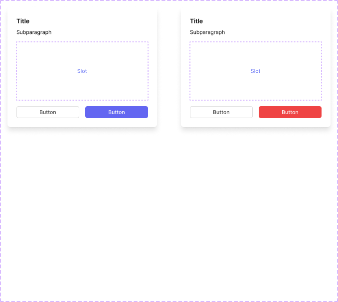
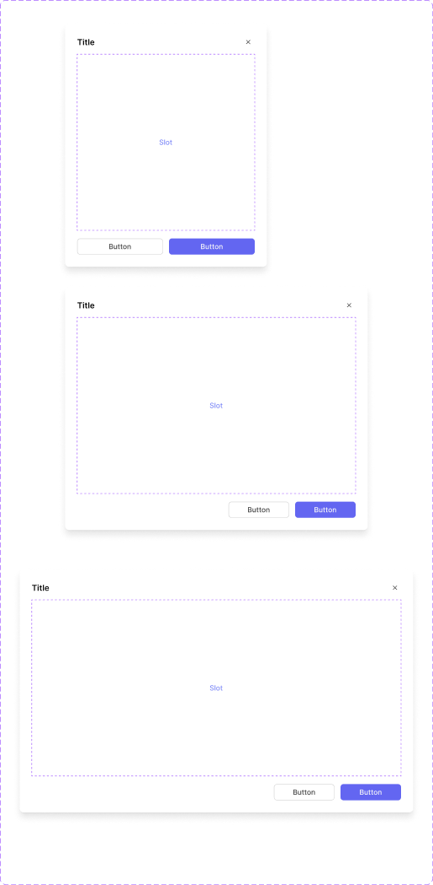

# Pop up / Modal / Dialog

Desktop's equivalent of [Bottom sheet](bottom-sheet.md) — a centered, elevated surface for confirmations and focused content, used **on Desktop** where Bottom sheet is used on mobile/narrow viewports. Two types: **Confirmation Dialog** (simple, short-form) and **Content Dialog** (larger, for substantial content).

Figma: [`✅ Pop up/ Modal/ Dialog`](https://www.figma.com/design/YFci6zgeYAQqX2OlHKQB0e) page. Tokens referenced below are defined in [`../DESIGN.md`](../DESIGN.md).

## Spec

Measured from Figma on 2026-10-07, then tidied with the design owner; Figma was updated to match. Where this section and the sections below disagree, this section is right.

Coded in [`components/src/overlay/Dialog.tsx`](../../../components/src/overlay/Dialog.tsx) (`ConfirmationDialog`, `ContentDialog`, and `Overlay` for the dimmed backdrop).

Both dialogs share one panel: fill `bg/primary`, `border-radii/rounded-8`, effect `shadow-lg`, no border. They sit centered on the [Overlay](overlay.md) scrim (`overlay/overlay-default`).

**Confirmation Dialog**

| Part | Value |
|---|---|
| Panel | 400px wide, padding `spacing/6` (24px), `spacing/4` (16px) between title block, optional content and buttons |
| Title | `Body/Medium-semibold`, `text + icon/primary` |
| Subparagraph (optional) | `Body/Small-regular`, `text + icon/primary`, `spacing/2` (8px) below the title |
| Buttons | two Medium [Buttons](button.md) sharing the width equally, `spacing/4` (16px) apart: Outline/Default on the left, Primary on the right |
| `Type=Default` | the right button is Primary/Blue |
| `Type=Destructive` | the right button is Primary/Danger |

**Content Dialog**

| Part | Value |
|---|---|
| Width | `Size=Small` 400px · `Size=Medium` 600px · `Size=Large` 780px |
| Header | padding 24px top, 24px sides, 12px bottom; title in `Body/Medium-semibold`, `text + icon/primary`; a 24px Ghost [Icon Button](button.md) with `icon/x` at the right, `spacing/4` (16px) from the title |
| Content | `spacing/6` (24px) side padding on every size; scrolls when it is taller than the space available |
| Footer | padding 16px top, 24px sides, 24px to the dialog's bottom edge; Medium buttons `spacing/3` (12px) apart, Outline first and Primary/Blue last |
| Footer buttons | Small: the buttons share the full width. Medium and Large: right-aligned, each at least 120px wide |

## Confirmation Dialog

`Title` → `Subparagraph` → `Slot` (arbitrary content area) → up to 3 CTA buttons.

| Part | Token(s) |
|---|---|
| Surface — fill, radius, shadow | `bg/primary`, `border-radii/rounded-8`, `shadow-lg` |
| Title | `text + icon/primary`, `Body/Medium-semibold` |
| Subparagraph | `text + icon/secondary`, `Body/Small-regular` |
| Section gaps (title block → slot → CTA row) | `spacing/4` (16px) |
| CTA button row gap | `spacing/2` (8px) |
| Outline (secondary) CTA border | `border/primary` |
| Primary CTA fill — `Type=Default` | `bg/accent-indigo` |
| Primary CTA fill — `Type=Destructive` | `bg/danger` |

**Variants:** `Type` = `Default` / `Destructive` (governs the primary CTA's color — indigo vs. red — for a routine confirmation vs. a destructive/irreversible action). `Third button` (boolean) adds an optional 3rd CTA alongside the standard secondary + primary pair.

**Behavior rules (per design owner, 2026-08-18):**
- **Max height is 480px.** Beyond that, the dialog doesn't keep growing — the **Subparagraph and Slot area become the scrollable regions** so the Title and CTA row stay pinned in view.
- Use `Type=Destructive` whenever the primary action is irreversible or data-destructive (delete, remove, discard) — matches the red-accent convention used for danger actions everywhere else in this system.

## Content Dialog

`Title` (+ optional close ✕) → `Slot` (the main scrollable content area) → CTA row.

| Part | Token(s) |
|---|---|
| Surface — fill, radius, shadow | `bg/primary`, `border-radii/rounded-8`, `shadow-lg` |
| Title | `text + icon/primary`, `Body/Medium-semibold` |
| Header padding | `spacing/4` (16px) |
| Header/body divider, CTA row divider | `border/primary`, `border-width/xs` |
| CTA button row gap | `spacing/2` (8px) |
| CTA row padding | `spacing/3`/`spacing/4` |

**Variants:** `Size` = `Medium` (600px wide) / `Large` (780px wide) — height is the same for both. `Close icon` and `Title` are independently toggleable.

**Behavior rules (per design owner, 2026-08-18):**
- **The Slot area is the scrollable region; max height is 480px**, same ceiling as Confirmation Dialog — Title and CTA row stay pinned, only the content in between scrolls.
- **Size choice depends on the content's shape, not an arbitrary preference:** default to `Medium`. Reach for `Large` specifically when the content needs a **two-column layout side by side** — the extra width (780 vs 600) exists to accommodate that, not just "more room."

## Known gaps (component doesn't yet match spec, or naming is inconsistent)

- **No scroll/clip frame implements the documented 480px max-height + scrollable-slot behavior yet** for either dialog type — both the Subparagraph text and the Slot area (an instance of the shared `.Slot Inner` atom) currently have `clipsContent: false` and no height constraint in the built Figma components. The *rule* is captured above; the component doesn't yet enforce it. Same "capture rules first, build later" gap pattern already used for Bottom sheet — flagging rather than building now, per standing approach for this audit.
- Confirmation Dialog's built height (320px) is well under the 480px max — expected, since 480 is a ceiling for when content grows, not a fixed height.

## Changelog

- **2026-10-07:** added the Spec section and tidied with the design owner. In Figma: the Large Content Dialog's side padding changed from 16px to `spacing/6` (24px) to match Small and Medium; a leftover `border/primary` stroke was removed from the Destructive dialog's red button. Corrected this doc and the snapshot: Content Dialog has three sizes (Small, Medium, Large), not two. First coded versions added.
- Fixed a **local instance override** on Confirmation Dialog's secondary/outline CTA button — its border was overridden to a stray `transparent/light` token (near-invisible, ~4% black) instead of inheriting the main [Button](button.md) component's documented `border/primary`. Rebound to match.
- **Retroactive fix to a shared atom:** found the `.Slot Inner` component (defined on the [Content Area](content-area.md) page, reused here for both dialog types' "Slot" placeholder) had never had its own dashed-border stroke-width bound — fixed on the main component (`border-width/xs`), which automatically corrected every instance across both this page and Content Area itself. Missed on the original Content Area audit; caught here because this page reuses the same atom.
- Verified colors, text styles, padding, gap, and corner-radius were otherwise already fully and correctly bound on both dialog types.
- Verified visually before/after — no rendering changes.
- Documented anatomy, variants, and behavior rules (max-height/scroll behavior, `Type=Destructive` usage, `Size` selection criteria) — sourced directly from the design owner, not inferred.
