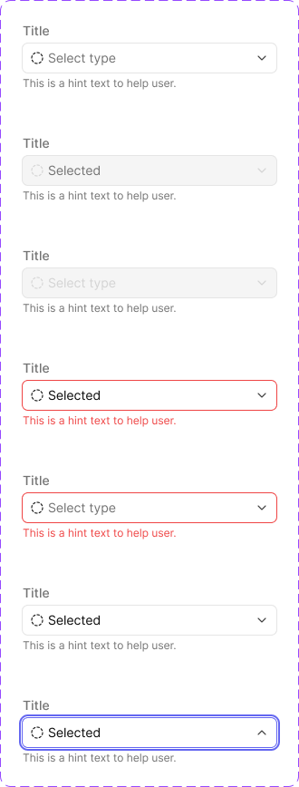
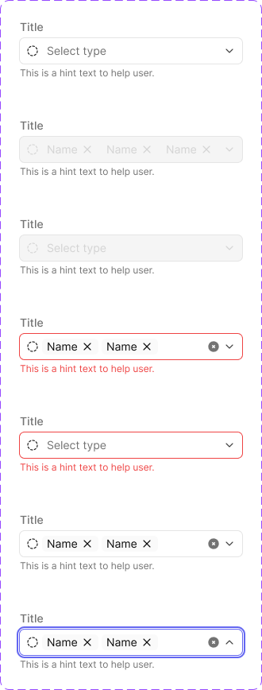

# Dropdown

Select input — single-value **Dropdown** and its **Multi-selection Dropdown** counterpart, which renders chosen values as removable chips instead of plain text. Both share the same anatomy, state model, and property structure.

Figma: [`✅ Dropdown`](https://www.figma.com/design/YFci6zgeYAQqX2OlHKQB0e) page. Tokens referenced below are defined in [`../DESIGN.md`](../DESIGN.md).

## Spec

Measured from Figma on 2026-10-06, then tidied with the design owner; Figma was updated to match. Where this section and the sections below disagree, this section is right.

Coded in [`components/src/menu/Dropdown.tsx`](../../../components/src/menu/Dropdown.tsx) (`Dropdown`; pass `multiple` for the multi-selection version). The open list is a [Menu](menu-item.md) panel directly below the field.

**The field** (shared by Text input, Text area, Dropdown and Multi-selection Dropdown)

| Part | Value |
|---|---|
| Label (above) | `Support/Label`, `text + icon/tertiary`; `spacing/1` (4px) above the box |
| Box | 32px high (Text area: 80px minimum), `border-radii/rounded-6`, fill `bg/primary`, border `border-width/xs` |
| Box padding | `spacing/2` (8px) left and right (Text area: 8px all sides); `spacing/1` (4px) between icon, text and trailing icon |
| Value text | `Body/Small-regular`, `text + icon/primary` |
| Placeholder text | `Body/Small-regular`, `text + icon/tertiary` |
| Hint (below) | `Support/Caption`, `text + icon/tertiary`; `spacing/1` (4px) below the box |
| Width | fills the width it is given (280px in the reference; Text area 320px) |

| State | Box fill | Box border | Text | Hint |
|---|---|---|---|---|
| `Placeholder` / `Filled` | `bg/primary` | `border/primary-subtle` | placeholder / value as above | `text + icon/tertiary` |
| `Focus` | `bg/primary` | `border/accent-indigo`, **plus** the system-wide focus ring (2px `border/accent-indigo`, 2px outside the box) | as above | `text + icon/tertiary` |
| `Error Placeholder` / `Error Filled` | `bg/primary` | `border/danger` | as above | `text + icon/danger` |
| `Disabled Placeholder` | `bg/disabled` | `border/primary-subtle` | `text + icon/disabled` | `text + icon/tertiary` |
| `Disabled Filled` | `bg/disabled` | `border/primary-subtle` | `text + icon/tertiary` | `text + icon/tertiary` |

A field shows `Focus` whenever it is active, whether reached by keyboard or by clicking into it.

**Dropdown extras**

| Part | Value |
|---|---|
| Prefix icon (optional) | 16px, `text + icon/primary` (`text + icon/disabled` when disabled) |
| Chevron | 16px at the right edge, `text + icon/secondary` (`text + icon/disabled` when disabled). `icon/chevron-down` when closed, `icon/chevron-up` when open |
| Open state | shown by the `Focus` variant: indigo border, focus ring, chevron up |
| The list | a [Menu](menu-item.md) panel the same width as the field, below it, scrolling after 240px. Single-select rows show a check when selected and close the list; multi-select rows show a checkbox and keep it open. The 4px gap between field and list is a coding choice — Figma does not show the two together |

**Multi-selection Dropdown**

Same field. When values are selected:

| Part | Value |
|---|---|
| Selected values | [Chips/Tag](chips-tag-badge.md) (`Hierarchy=Primary`, `Roundness=False`) with a 16px `icon/x` suffix to remove one, `spacing/1` (4px) apart |
| Clear all | 16px `icon/circle-x`, `text + icon/tertiary`, just before the chevron |
| Disabled, with values | the chips use their own `Disabled` state |

## Anatomy

`Title` label → input box (prefix icon, value/placeholder, chevron) → hint/caption text.

| Part | Token(s) |
|---|---|
| Title label | `text + icon/tertiary`, `Support/Label` |
| Input box — default border/fill | `bg/primary`, `border/primary-subtle`, `border-width/xs`, `border-radii/rounded-6` |
| Input box — focus border | `border/accent-indigo` |
| Input box — error border | `border/danger` |
| Input box — disabled fill/border | `bg/disabled` |
| Prefix icon slot | `INSTANCE_SWAP` property, boolean-toggleable |
| Value text (filled) | `text + icon/primary`, `Body/Small-regular` |
| Placeholder text | `text + icon/tertiary`, `Body/Small-regular` |
| Disabled value/placeholder text | `text + icon/disabled` |
| Chevron | Flips up when `State=Focus` (open), down otherwise |
| Hint/caption text | `text + icon/tertiary`, `Support/Caption` |
| Error caption text | `text + icon/danger` |
| Gap between prefix icon and value/placeholder | `spacing/1` (4px) |
| **Multi-select only** — chip row background (Placeholder-family states) | `bg/secondary` |
| **Multi-select only** — gap between chips (Filled-family states) | `spacing/1` (4px) |
| **Multi-select only** — clear-all "✕" button | Appears only once at least one chip is selected |

## Variants

`State` = `Placeholder` / `Filled` / `Focus` / `Error Placeholder` / `Error Filled` / `Disabled Placeholder` / `Disabled Filled`. Plus boolean/instance-swap properties: `Prefix icon` (on/off), `Instance` (which icon), `Caption` (hint text on/off), `Title` (label on/off). 7 states × both components, all built.

- **Placeholder vs. Filled** is the base empty/has-value split, orthogonal to `Error`/`Disabled` — hence the compound state names (`Error Filled`, `Disabled Placeholder`, etc.) rather than separate boolean properties.
- **`Focus`** only has a "Filled" look in the built variants (no `Focus Placeholder`/`Focus Empty` — see Known gaps).
- **Multi-selection Dropdown's chip content uses the [Chips/Tag component](chips-tag-badge.md)** internally for each selected value — its own removable "✕" affordance is the same pattern documented there, not a separate mechanism.

## Behavior rules

- **State precedence:** `Disabled` overrides interactivity entirely (no hover/focus/error possible while disabled). `Error` can co-occur with either `Placeholder` or `Filled` — a field can be shown as invalid whether or not the user has made a selection yet (e.g. a required field left empty on submit).
- **Focus shows an open state visually** (chevron flips up, border turns `accent-indigo`) — this represents the dropdown menu being open, not just keyboard focus without an open menu.
- **Multi-select's clear-all "✕" is distinct from each chip's own "✕":** the small circular "✕" that appears after the last chip (before the chevron) clears the entire selection in one action; each chip's own "✕" removes just that one value.
- **Title and Caption are independently toggleable** — a dropdown can be used without a visible label (e.g. in a dense toolbar) or without hint text, per the `Title`/`Caption` boolean properties.

## Known gaps (component doesn't yet match spec, or naming is inconsistent)

- **No `Focus`-plus-`Placeholder` or `Focus`-plus-`Error` combinations built** — `Focus` only exists as a single state showing a filled value with an indigo border. If a real interaction requires showing focus on an empty or invalid-and-open field, no variant currently covers it.
- Prefix/chevron icon internals (~1.1px vector strokes) and the multi-select's embedded Chips/Tag icon internals are left unbound — same precedent as other components (no exact Foundation match; nested instances of already-documented components are out of scope here).

## Changelog

- **2026-10-06:** added the Spec section and tidied with the design owner. In Figma: disabled text now matches Text input on both dropdowns (a disabled value is `text + icon/tertiary`, a disabled placeholder is `text + icon/disabled`; they were the other way round); the disabled multi-select chips' remove icon uses `text + icon/disabled` instead of a border token; the `Focus` variants carry the system-wide focus ring. First coded version added (single and multi-selection).
- Bound the input box's border width (previously raw `1`, unbound) to `border-width/xs`, and the gap between the prefix icon and value/placeholder text (previously raw `4`, unbound) to `spacing/1` — across all 7 states, on both `Dropdown` and `Multi-selection Dropdown`.
- **Multi-selection Dropdown:** bound the chip-row wrapper's internal gap (previously raw, unbound) — `spacing/2,5` (10px) on the 3 `Placeholder`-family states (icon-to-placeholder-text gap), `spacing/1` (4px) on the 3 `Filled`-family states (gap between chip pills). One instance (the `Focus` state's chip row) was missed on the first automated pass and caught on manual re-verification — fixed the same way.
- Verified colors and text styles were already fully bound to this system's semantic tokens on both components — no color-binding bugs found here (unlike several prior components).
- Verified visually before/after on both components — no rendering changes.
- Documented anatomy, state model, and behavior rules for both components — not previously written down.
