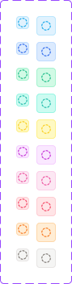

# Icon sidebar

A small tinted icon container — a rounded-square chip with a colored background/border holding a single icon, sized to match the icon exactly (no internal padding). Used for sidebar navigation icons and similar decorative icon-with-color-tag contexts.

Figma: [`✅ Icon sidebar`](https://www.figma.com/design/YFci6zgeYAQqX2OlHKQB0e) page. Tokens referenced below are defined in [`../DESIGN.md`](../DESIGN.md).

## Spec

Measured from Figma on 2026-10-06; Figma was tidied to match where noted in the Changelog. Where this section and the sections below disagree, this section is right.

Coded in [`components/src/avatar/SidebarIcon.tsx`](../../../components/src/avatar/SidebarIcon.tsx) (`SidebarIcon`).

| Property | Value |
|---|---|
| Container | `Size=16px`: 16×16px · `Size=24px`: 24×24px |
| Icon | **14px in both sizes**, centered (1px of space around it at 16px, 5px at 24px) |
| Radius | `border-radii/rounded-4` |
| Border | `border-width/xs` (1px), `border/accent-<color>` |
| Fill | `bg/accent-<color>` |
| Icon color | `text + icon/accent-<color>` |

`<color>` is one of `ocean`, `sky`, `teal`, `sun`, `fuchsia`, `blossom`, `emerald`, `blush`, `peach`, `stone`; fill, border and icon always use the same one.

## Anatomy

| Part | Token(s) |
|---|---|
| Container fill | `bg/accent-<color>` |
| Container border | `border/accent-<color>`, `border-width/xs` |
| Container radius | `border-radii/rounded-4` |
| Icon | Swappable instance (`Instance` property), default Tabler `icon/circle-dashed`; tint typically `text + icon/accent-<color>` |
| Container size | 16px or 24px; the icon inside is 14px in both, centered via alignment |

## Variants

`Color` = `Sky` / `Ocean` / `Emerald` / `Teal` / `Sun` / `Fuchsia` / `Blossom` / `Blush` / `Peach` / `Stone` — the same 10-color decorative accent family used elsewhere in the system (avatar initials, badges, etc.). `Size` = `16px` / `24px`. 20 total combinations, all built.

## Behavior rules

- **Color is purely decorative, never semantic** — per the system-wide accent-color rule (`DESIGN.md` §2.2): these 10 colors exist only to visually distinguish adjacent sidebar items, not to convey status. Don't assign a color based on meaning (e.g. don't reach for `Blush` because a section feels "urgent") — pick for visual variety/distinction only.
- **Size choice follows context density**, not content: use `16px` for compact/nested nav rows, `24px` for top-level or more prominent sidebar entries. Both sizes render at identical proportions (icon fills the container with no padding), so switching sizes doesn't change the visual treatment, just the scale.
- **The icon itself is swappable per instance** (`Instance` property, `INSTANCE_SWAP`) — the component defines a preferred icon in Figma's property panel, but any icon in the system's Tabler set can be substituted per usage.

## Known gaps (component doesn't yet match spec, or naming is inconsistent)

None found — this component's color, border, radius, and border-width bindings were already fully correct and consistent with the rest of the system on first audit. No stray/foreign tokens, no unbound sizing.

## Changelog

- **2026-10-06:** added the Spec section. Corrected the icon size: this doc said the icon fills the container, but the icon is 14px in both the 16px and 24px sizes. First coded version added.
- Audited color (fill/border), corner-radius, and border-width bindings across all 20 variants — all were already correctly bound to this system's semantic accent tokens and Foundation primitives. No fixes needed.
- Documented anatomy, variants, and usage rules (in particular, the "color is decorative only" rule inherited from the system-wide accent-color convention) — not previously written down.
