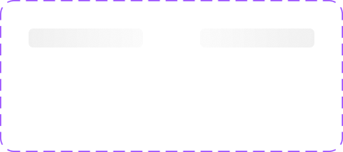

# Loading

A skeleton-loading placeholder bar with a two-phase shimmer gradient, used to indicate content is loading before it appears (e.g. in place of a text line, avatar, or card while data fetches).

Figma: [`✅ Loading`](https://www.figma.com/design/YFci6zgeYAQqX2OlHKQB0e) page. Tokens referenced below are defined in [`../DESIGN.md`](../DESIGN.md).

## Spec

Measured from Figma on 2026-10-07. Where this section and the sections below disagree, this section is right.

Coded in [`components/src/layout/Loading.tsx`](../../../components/src/layout/Loading.tsx).

| Part | Value |
|---|---|
| Bar | 16px high, `border-radii/rounded-4`; its width is set by where it is used (96px in the component) |
| Fill | a left-to-right gradient from a paint style, not a color token (see table) |
| Animation | the bar fades between `Phase=1` and `Phase=2`, which are the same gradient reversed |

| `Light Mode?` | Use on | `Phase=1` (style) | `Phase=2` (style) |
|---|---|---|---|
| `True` | light surfaces | black 6% → black 2% (`Loading/light`) | black 2% → black 6% (`Loading/light-2`) |
| `False` | dark surfaces | white 10% → white 3% (`Loading/dark`) | white 3% → white 10% (`Loading/dark-2`) |

In code these four gradients are the utilities `bg-loading-light`, `bg-loading-light-2`, `bg-loading-dark` and `bg-loading-dark-2`, defined in the project's `tokens.css`.

## Anatomy

| Part | Token(s) |
|---|---|
| Corner radius | `border-radii/rounded-4` |
| Padding (horizontal) | `spacing/1` (4px) |
| Gap | `spacing/1` (4px) — inert on its own (component has no children to space), bound for consistency |
| Fill | Dedicated local **paint styles** (not variables — gradients in this file are gradient-stop styles, not variable-bound): `Loading/light`, `Loading/light-2`, `Loading/dark`, `Loading/dark-2` |
| Example dark backdrop (in the DS page, not part of the component) | `bg/accent-indigo-bolder` |

## Variants

`Phase` = `1` / `2`. `Light Mode?` = `True` / `False`. 4 total combinations, all built.

- **`Phase` drives the shimmer animation**: the gradient's highlight position shifts between `1` and `2`, so animating between them (toggling or interpolating on an interval) produces the sweeping shimmer effect. Neither phase is a "resting" state — they're two frames of one animation loop.
- **`Light Mode?` is about the surface it sits on, not the app's theme** — `True` uses a subtle black-alpha gradient (for placement on a light/white surface); `False` uses a white-alpha gradient (for placement on a bold/colored surface, e.g. the indigo example shown on the DS page). This project has no implemented app-wide dark mode elsewhere (see `DESIGN.md` — dark-mode token *values* exist but aren't built into any component yet), so don't read this property as "dark mode support" — it's a light-surface/bold-surface toggle scoped to this one component.

## Behavior rules

- **Resize to match what's loading** — the bar has no fixed content, so stretch/shrink it to the shape of whatever's being replaced (a short line for a label, a wide line for a paragraph, etc.). There's no separate "size" variant; sizing is a per-instance layout decision.
- **Animate, don't pick one static phase** — using only `Phase=1` or only `Phase=2` as a permanently static state defeats the shimmer effect. Both phases exist to be cycled between.

## Known gaps (component doesn't yet match spec, or naming is inconsistent)

- **`Light Mode?` property name is a bit misleading** given it's actually about the underlying surface color (light vs. bold), not the app's light/dark theme (which doesn't otherwise exist as an implemented mode in this file). Flagging rather than renaming — same reasoning as other variant-property naming flags: renaming affects every existing instance, not done without confirmation.
- Vertical padding (3px top/bottom, unbound) doesn't cleanly map to the `spacing/*` primitive scale and the property is inert anyway (the component has no children for padding to affect) — left unbound rather than force-fit to an incorrect token.

## Changelog

- **2026-10-07:** added the Spec section. No Figma changes were needed. First coded version added, with the four `Loading/*` paint styles mirrored as utilities in `tokens.css`.
- Bound corner radius (previously raw `4`, unbound) to `border-radii/rounded-4`, and horizontal padding + gap (previously raw `4`, unbound) to `spacing/1`, across all 4 variants.
- Investigated the gradient fills initially flagged as "unbound raw color" — confirmed on closer inspection these correctly reference 4 dedicated local **paint styles** (`Loading/light`, `light-2`, `dark`, `dark-2`) via `fillStyleId`, a different (and in this case correct) Figma binding mechanism from the color *variables* used elsewhere in this system. Not a bug.
- Verified visually before/after — no rendering changes.
- Documented anatomy, variants, and usage rules (in particular, clarifying that `Light Mode?` is surface-relative, not app-theme-relative) — not previously written down.
