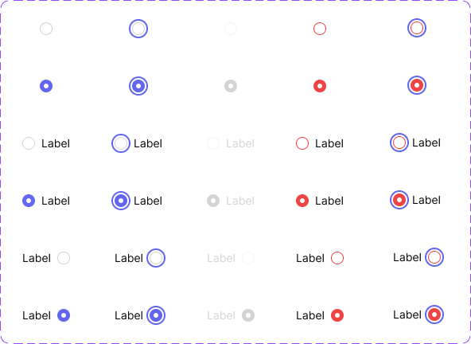
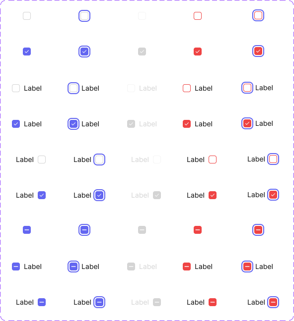
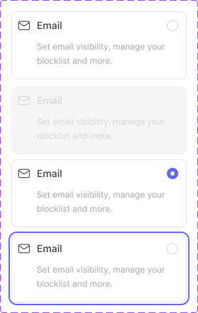

# Radio button, Checkbox button, & Radio card

Three related selection controls documented together because they share one Figma page: **Radio button** (single-select dot), **Checkbox button** (multi-select square), and **Radio card** (a selectable settings-row card that embeds a Radio button internally — renamed from `Settings/ToggleCard` 2026-08-18, since it was never toggle-switch-based; see [Toggle](toggle.md) for the actual switch-based equivalent, `Toggle card`).

Figma: [`✅ Radio button & Card & check box`](https://www.figma.com/design/YFci6zgeYAQqX2OlHKQB0e) page. Tokens referenced below are defined in [`../DESIGN.md`](../DESIGN.md).

## Spec

Measured from Figma on 2026-10-05, then normalised with the design owner; Figma was updated to match. Where this section and the sections below disagree, this section is right.

Coded in [`components/src/selection/`](../../../components/src/selection/) (`Checkbox`, `Radio`, `RadioCard`).

**Shared by Radio button and Checkbox button**

| Property | Value |
|---|---|
| Label | `Body/Small-regular`, `text + icon/primary`; `text + icon/disabled` when disabled |
| Gap between control and label | Radio: `spacing/1` (4px) from its 24px box. Checkbox: `spacing/2` (8px) from its 16px box. Both put the label 8px from the visible control, clear of the focus ring |
| Border | `border-width/xs` (1px), only when not selected |

| State | Not selected | Selected (and Checkbox `Half`) |
|---|---|---|
| `Default` | no fill, border `border/primary` | fill `bg/accent-indigo`, no border |
| `Error` | no fill, border `border/danger` | fill `bg/danger`, no border |
| `Disabled` | no fill, border `border/disabled` | fill `bg/tertiary`, no border |
| `Focus` | as `Default`, plus the focus ring | as `Default`, plus the focus ring |
| `Error Focus` | as `Error`, plus the focus ring | as `Error`, plus the focus ring |

**Focus — the system-wide rule:** the control keeps its colors and gains a `border-width/sm` (2px) `border/accent-indigo` ring, 2px outside its edge. Keyboard focus only. There is no hover state.

**Radio button**

| Part | Value |
|---|---|
| Circle | 16×16px, `border-radii/rounded-infinite`, centered in a 24×24px box (so a labelled radio row is 24px high) |
| Selected dot | 6×6px circle, `bg/primary`, centered |
| Focus ring | 24px circle |

**Checkbox button**

| Part | Value |
|---|---|
| Box | 16×16px at its default size, `border-radii/rounded-4`, no surrounding padding (a labelled row is 20px high) |
| Check mark (`Selected`) | 8×6px, `text + icon/primary-inverse` |
| Dash (`Half`) | 9×2px, fully rounded, `text + icon/primary-inverse` |
| Focus ring | 24px square, `border-radii/rounded-8` |

**Radio card**

| Part | Value |
|---|---|
| Card | padding `spacing/2` (8px), `border-radii/rounded-8`, fill `bg/primary`, border `border/primary-subtle`; fills the width it is given (248px in the reference) |
| Header row | 24px high: 20px icon, `spacing/2` (8px) gap, name, then the radio at the right edge |
| Name | `Body/Small-medium`, `text + icon/secondary` |
| Description | `Body/Mini-regular`, `text + icon/tertiary`; `spacing/2` (8px) below the header, indented 28px so it lines up with the name, 8px bottom padding |
| `State=Selected` | only the radio changes; the card itself looks the same |
| `State=Focus` | the focus ring goes around the **whole card** (`border-radii/rounded-12`), not the radio dot, because the whole card is the click target |
| `State=Disabled` | fill `bg/disabled`, border `border/disabled`, name and description `text + icon/disabled` |

## Radio button

| Part | Token(s) |
|---|---|
| Ring — default | `border/primary` |
| Keyboard focus | resting colors plus a 2px `border/accent-indigo` focus ring outside the control (see Spec) |
| Fill — selected | `bg/accent-indigo`, no border |
| Ring/fill — error | `border/danger` (not selected) or `bg/danger` fill (selected); error + focus adds the same indigo focus ring |
| Ring — disabled | `border/disabled`, fill `bg/tertiary` when selected |
| "Highlight" — the white gap ring between the colored ring and the filled center dot | `bg/primary` |
| Shape | `border-radii/rounded-infinite` (forces a perfect circle), `border-width/xs` |
| Label | `text + icon/primary`, `Body/Small-regular`, `spacing/1` gap from the dot |

**Variants:** `Type` = `Not-Selected` / `Selected`. `State` = `Default` / `Focus` / `Disabled` / `Error` / `Error Focus`. `Label` = `None` / `Left` / `Right`. 30 total, all built.

## Checkbox button

Same anatomy and token set as Radio button, but square with `border-radii/rounded-4` instead of a circle, and a checkmark glyph (`text + icon/primary-inverse` on the indigo fill) instead of a center dot. Same variant structure: `Type` × `State` × `Label`, now **45 total** (see `Type=Half` below).

**This is the canonical checkbox for the whole design system.** A second, separate "bare" checkbox component previously lived on the Toggle page (no label, no focus/error states, Rounded/Square shape choice) and was independently embedded in Table (`Table First Column header`, `Field first column`) and Menu item (`Multi Selection`) — 13 instances total. All 13 have been relinked to reference this component instead. The bare checkbox's whole section has since been moved to the "unused components" page and the Toggle page renamed accordingly (from "Toggle & Checkbox" to "Toggle") — see [Toggle](toggle.md)'s changelog.

The checkbox glyph's container is **16×16px at its native/default size, edge-to-edge with no padding** (fixed 2026-08-18 — it was previously a 24×24px container with the 16×16 glyph inset by 4px on each side, an unintentional gap). **Instance size is adaptable by design, not fixed to 16px** — resize the instance per context (Table/Menu item's 13 relinked instances are deliberately scaled down to 14×14px to match their compact rows; other contexts might reasonably use 12px or 16px). Because the whole glyph (box, checkmark/dash, border) scales together as one instance, any size reads correctly — there's no separate "Size" variant needed, unlike Avatar.

**Variants:** `Type` = `Not-Selected` / `Selected` / **`Half`** (indeterminate — added 2026-08-18, see Changelog). `State` = `Default` / `Disabled` / `Error Focus` / `Focus` / `Error`. `Label` = `None` / `Left` / `Right`.

- **`Half` represents "some but not all" in a group** — e.g. a "select all" header checkbox when only some rows are selected. Renders as the same indigo fill as `Selected`, with a horizontal dash instead of a checkmark.

## Radio card

A settings-row card — leading icon, name, description, and a trailing **Radio button instance** (not an independent control; it's literally an embedded instance of the Radio button component above, so fixes to Radio button's main component automatically apply here too).

| Part | Token(s) |
|---|---|
| Card — fill, border, radius | `bg/primary` (`bg/disabled` when `State=Disabled`), `border/primary-subtle` (`border/disabled` when disabled), `border-width/xs`, `border-radii/rounded-8` |
| Name | `text + icon/secondary`, `Body/Small-medium` |
| Description | `text + icon/tertiary`, `Body/Mini-regular` |
| Name/icon gap | `spacing/2` |

**Variants:** `State` = `Default` / `Disabled` / `Selected` / `Focus`. Plus `Tag/status` (boolean, adds a status tag next to the name via a swappable `Tag type` instance) and `Description?` (boolean).

## Behavior rules

- **Radio vs. Checkbox is a single-select vs. multi-select decision**, same convention as everywhere else in the system (and as [Menu item](menu-item.md)'s Single/Multi Selection rows) — don't use Checkbox where only one option can be true at a time.
- **`Focus` and `Error Focus` add the system-wide focus ring** (2px `border/accent-indigo`, outside the control) and change nothing else — this is the keyboard-focus-visible treatment, not a hover state (there's no `Hover` variant).
- **Radio card's embedded radio indicator is presentational, driven by the card's own `State`** — clicking anywhere on the card (not just the dot) should toggle it; the dot isn't meant to be a separately-focusable target within the card.
- **Checkbox button's size is adaptable per context, not locked to its 16px default** — scale the instance to whatever fits the surrounding density (12/14/16px and beyond are all fair game). This is different from components like Avatar that expose a dedicated `Size` variant; here, uniform instance scaling is the intended mechanism since the whole glyph scales together cleanly.

## Known gaps (component doesn't yet match spec, or naming is inconsistent)

- Icon internals (checkmark vector strokes) are left unbound — same precedent as other components (no exact Foundation match).

## Changelog

- **2026-10-05:** added the Spec section and normalised Radio button and Checkbox button with the design owner, in Figma and in code. (1) **Focus** now uses the same ring as Button: the pale halo is removed (on Checkbox it was hidden behind the box and never showed) and each of the 10 base Focus variants carries a `Focus ring` layer bound to `border-width/sm`. (2) **Selected fills use background tokens**: `text + icon/danger` → `bg/danger`, `text + icon/accent-indigo` → `bg/accent-indigo` (no visual change), and the disabled fill `text + icon/disabled` → `bg/tertiary` (same grey). (3) Radio card's `State=Disable` renamed to `Disabled`. (4) Corrected this doc's Radio card tokens (border, name and description colors) to match Figma. First coded versions added in `components/src/selection/`. (5) Labelled Checkbox variants: label gap widened from `spacing/1` to `spacing/2` so the focus ring no longer touches the label. (6) Radio card gained a `State=Focus` variant with the ring around the whole card.

- **User-directed consolidation (2026-08-18):** added a `Type=Half` (indeterminate) variant across all `State`×`Label` combinations (15 new variants: dash indicator replacing the checkmark, same indigo fill as `Selected`). Built by cloning the `Selected` variants and, for `Label=Left`/`Right` (which internally embed a `Label=None` instance rather than duplicating the glyph), swapping that nested instance's `Type` property to `Half` rather than trying to edit its internals directly — editing a nested instance's children via `.remove()` doesn't work from outside (only property overrides do) and silently corrupted rendering on the first attempt; rebuilt cleanly once diagnosed. Then relinked all 13 real-world embedded checkbox instances in Table and Menu item from the old bare checkbox component to this one, resizing each to 14×14px to preserve the existing row layouts.
- **User fix (2026-08-18):** the glyph's container was 24×24px with the 16×16 circle inset 4px on every side — an unintentional gap, not a deliberate design choice. Resized the container to 16×16px and moved the circle to fill it edge-to-edge, on all 15 `Label=None` variants (`Label=Left`/`Right` inherited the fix automatically via their nested-instance reference). First attempt used `.resize()` directly, which proportionally scaled the circle down too (to ~10.7×10.7) — not what was wanted; fixed by explicitly forcing the circle back to a fixed 16×16 and repositioning the checkmark/dash glyph to match, rather than relying on proportional resize.

- **Radio button:** fixed the "Highlight" ring (the white gap between the colored ring and the filled center dot) — was bound to a foreign `Text/Inverted` token (`#ffffff`) despite being a background element, not text. Rebound to `bg/primary` (identical value, correct semantic source).
- **Radio button & Checkbox button:** programmatically walked and fixed corner-radius on every ring/highlight circle (previously raw `100` or `9999` — the "force a perfect circle with an oversized radius" pattern seen before in Avatar and Button) → `border-radii/rounded-infinite`, and border-width on every ring (previously raw `1`, unbound) → `border-width/xs`. Applied across all 30 variants of each component plus their nested Label-wrapper instances — ~35 corner-radius fixes and ~30 border-width fixes in total.
- **Radio card:** bound the card's own corner radius (previously raw `8`, unbound) → `border-radii/rounded-8` on all 3 states; bound the icon/name gap → `spacing/2`.
- Verified visually before/after on all three components — no rendering changes.
- Documented anatomy, variants, and behavior rules — not previously written down.
- **User rename (2026-08-18):** renamed the Figma component from `Settings/ToggleCard` to `Radio card`, correcting a misleading name (it embeds a Radio button, never a toggle switch) now that the actual toggle-switch-based equivalent (`Toggle card`, on the Toggle page) has been identified as a separate component. Doc updated to match.
- **User action (2026-08-18):** after Checkbox button's `Half` state addition and the relink of all 13 real usages away from the old bare checkbox component, the user moved that component's entire section to the "unused components" page and renamed the source page from "Toggle & Checkbox" to "Toggle". Its final binding fixes (a stray `Text/Inverted` color, unbound corner-radius/border-width) are documented in [Toggle](toggle.md)'s changelog rather than here, since that was its source page.
