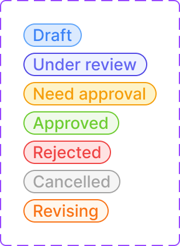

# Request list / Status badge

The colored pill showing a request's workflow status, used in the table's Status column.

Figma: [`📱 Request list`](https://www.figma.com/design/YFci6zgeYAQqX2OlHKQB0e) page, `Status_Badge` component (inside `Request Table`).

## Spec

Measured from the Figma component on 2026-10-05. Where this section and the tables below disagree, this section is right.

| Property | Value |
|---|---|
| Height | 20px (hugs the label's line height; no vertical padding) |
| Horizontal padding | `spacing/2` (8px) each side |
| Radius | `border-radii/rounded-infinite` |
| Border | `border-width/xs` (1px), always present |
| Label | `Body/Small-medium`, one line |

Every state has a fill, a border **and** a text color:

| State | Label shown | Fill | Border | Text |
|---|---|---|---|---|
| `Draft` | Draft | `bg/info-subtle` | `border/info` | `text + icon/info` |
| `Under review` | Under review | `bg/accent-indigo-subtlest` | `border/accent-indigo-bolder` | `text + icon/accent-indigo` |
| `Need approval` | Need approval | `bg/warning-subtle` | `border/warning` | `text + icon/warning` |
| `Approved` | Approved | `bg/success-subtle` | `border/success` | `text + icon/success` |
| `Rejected` | Rejected | `bg/danger-subtle` | `border/danger` | `text + icon/danger` |
| `Cancel` | Cancelled | `bg/disabled` | `border/primary-bolder` | `text + icon/tertiary` |
| `Revising` | Revising | `bg/urgent-subtle` | `border/urgent` | `text + icon/urgent` |

## Anatomy

| Part | Token(s) |
|---|---|
| Pill — fill, border, text, radius | per-state fill + border + text (see Spec), `Body/Small-medium`, `border-radii/rounded-infinite`. Built as a nested [Badge](chips-tag-badge.md) instance |

## Variants

`State` — 7 states: `Draft`, `Under review`, `Need approval`, `Approved`, `Rejected`, `Cancel` (label reads "Cancelled"), `Revising`. Exact tokens per state are in the Spec table above.

## Behavior rules

- **One state is shown per request row at a time** — reflects the request's current position in the approval workflow.
- **See [Status label (detail view)](request-detail-status-label.md) for the equivalent status indicator used inside the request-detail slide-over** — same underlying states, different visual treatment (pill badge here vs. a vertical colored-text list there) and a naming mismatch worth resolving (see Known gaps).

## Known gaps (component doesn't yet match spec, or naming is inconsistent)

- **The `Cancel` variant is named differently from its label** ("Cancelled").

- **State-name mismatch with [Status label (detail view)](request-detail-status-label.md)**: this component's first state is `Draft`, while the detail-view equivalent's first state is `Submitted` — these may be the same workflow state named differently (a request that hasn't been submitted yet vs. one that has), or two genuinely different states depending on where in the flow a request sits. Flagging rather than assuming which is correct — worth confirming with the design owner since it affects which badge a "just-created, not-yet-submitted" request should show.

## Changelog

- **2026-10-05:** `Revising` border rebound from a raw `#bd4b00` to the new `border/urgent` token (`orange/500`, same orange as its text) — design-owner decision. The border is lighter than before.
- **2026-10-05:** added the Spec section (measured sizes and exact tokens per state) after a trial build from this doc produced outline-only badges with guessed colors. Corrected the state list: the property is `State`, not `Property 1`, and there are 7 states including `Revising`, which was undocumented.
- Fixed foreign color tokens and bound previously-unbound spacing/radius — part of the 511-fix `Request Table` pass.
- Verified visually before/after — no rendering changes.
- Documented anatomy, variants, and behavior rules for the first time, and flagged the naming mismatch against the detail-view status indicator — not previously compared.
