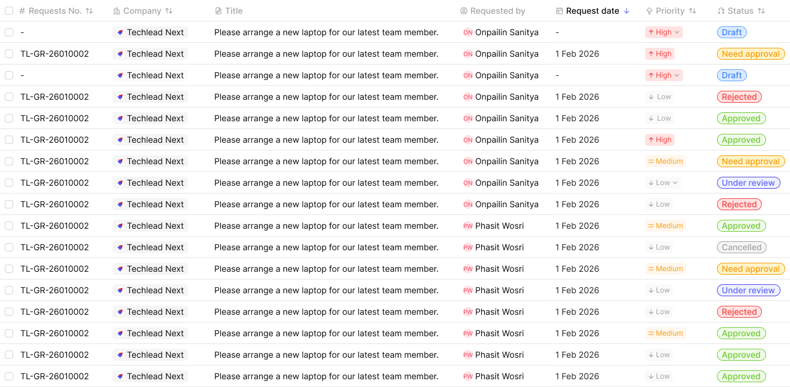

# Request list / Table row

The header row and body row that make up the desktop request table.

Figma: [`📱 Request list`](https://www.figma.com/design/YFci6zgeYAQqX2OlHKQB0e) page, `Table row header` and `Table row content` components (inside the `Request Table` frame).

## Spec

Measured from the Figma component on 2026-10-05. Where this section and the tables below disagree, this section is right.

**Rows**

| Property | Value |
|---|---|
| Row height | 36px, header and body alike |
| Lines | each cell has a **bottom border only** — `border/primary-subtle`, `border-width/xs`. No vertical lines between columns |
| Cell fill by state | `Default` / `loding`: `bg/primary` · `Hover`: `bg/primary-hover` · `Selected` and `Multi Seclected`: `bg/accent-indigo-subtlest` |
| Cell padding (body) | `spacing/2` (8px) top, bottom and left; `spacing/1` (4px) right |
| Cell padding (header) | `spacing/2` (8px) all sides |
| Text | one line per cell, never wraps; the Title column truncates |

**Columns** (widths in the 1020px-wide component; Title takes whatever width is left)

| # | Column | Width | Body cell content |
|---|---|---|---|
| 1 | Requests No. | 180px | 14px checkbox (in a 22px box, 4px from the row's left edge), then the number as `Body/Small-regular`, `text + icon/primary` |
| 2 | Company | 170px | [Company chip](request-list-company-chip.md) |
| 3 | Title | fills | `Body/Small-regular`, `text + icon/primary` |
| 4 | Requested by | 160px | 16px [Avatar](avatar.md) (low-contrast letter) + name as `Body/Small-regular`, `text + icon/primary`, `spacing/1` (4px) apart, inset `spacing/1,5` (6px) |
| 5 | Request date | 150px | `Body/Small-regular`, `text + icon/primary`, e.g. "1 Feb 2026"; "-" when empty |
| 6 | Priority | 120px | [Priority status](create-form-priority.md) chip |
| 7 | Status | 130px | [Status badge](request-list-status-badge.md) |

**Header cells**

| Part | Value |
|---|---|
| Leading icon | 14px, `text + icon/tertiary` |
| Label | `Body/Small-medium`, `text + icon/tertiary`; the currently sorted column's label is `text + icon/primary` |
| Icon-to-label gap | `spacing/1` (4px) |
| Sort control | 24px [Icon Button](button.md) (`rounded-6`) at the right edge of sortable columns |
| First cell | select-all checkbox (14px) before the "Requests No." label |

## Anatomy

| Part | Token(s) |
|---|---|
| Row container — fill, border | `bg/primary`, `border/primary-subtle`, `border-width/xs` |
| Column label (header) | `text + icon/tertiary`, `Body/Small-medium` |
| Cell value | `text + icon/primary`, `Body/Small-regular` |
| Checkbox (bulk-select) | shared checkbox control |
| Embedded status/company chips | see [Status badge](request-list-status-badge.md), [Company chip](request-list-company-chip.md) |

## Variants

`Table row header` is a single fixed component. `Table row content` has 5 states via `Property 1`: `Default`, `Hover`, `Multi Seclected` [sic], `loding` [sic], `Selected`.

## Behavior rules

- **`Hover` previews row interactivity before a click; `Selected` is a single-row selection (e.g. row click); `Multi Seclected` is the bulk-checkbox state** — distinct from `Selected`, since bulk selection shows the checkbox checked while single selection may just highlight the row. Confirm the exact trigger for `Selected` vs `Multi Seclected` with the design owner since Figma doesn't encode click-target semantics.
- **`loding` is a skeleton/placeholder row** shown while table data is being fetched — see [No results](request-list-empty-state.md) for the complementary zero-results state.

## Known gaps (component doesn't yet match spec, or naming is inconsistent)

- **`Multi Seclected` and `loding` are misspellings** of "Multi Selected" and "Loading" — flagging for a rename, not renamed without confirmation since it's a live variant name referenced elsewhere.

## Changelog

- **2026-10-05:** fixed the `Hover` row's Priority cell, which was filled `bg/accent-stone`; it is now `bg/primary-hover` like every other cell — design-owner decision.
- **2026-10-05:** added the Spec section (row height, borders, column widths, per-column content) after a trial build from this doc produced wrapping, uneven rows.
- Fixed foreign color tokens and bound previously-unbound `itemSpacing`/padding/`cornerRadius`/`strokeWeight` across both components — part of a combined 511-fix pass on the whole `Request Table` frame (8 components).
- Verified visually before/after — no rendering changes.
- Documented anatomy, variants, and behavior rules for the first time — neither component previously had a doc.
