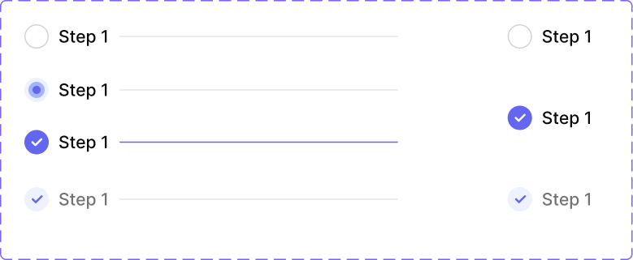

# Steps

A horizontal step-indicator for multi-step flows (onboarding wizards, checkout, setup flows). Two components: **Step** (a full row — status dot + label + connector line to the next step) and **Progressing** (the small standalone status dot used inside Step, and also usable on its own — e.g. a compact status icon elsewhere).

Adapted from the open-source [chakra-ui-steps](https://github.com/jeanverster/chakra-ui-steps) reference (linked directly on the Figma page) — the likely source of the spelling inconsistencies that were found and fixed here (see Changelog).

Figma: [`✅ Steps`](https://www.figma.com/design/YFci6zgeYAQqX2OlHKQB0e) page. Tokens referenced below are defined in [`../DESIGN.md`](../DESIGN.md).

## Spec

Measured from Figma on 2026-10-07, then tidied with the design owner; Figma was updated to match. Where this section and the sections below disagree, this section is right.

Coded in [`components/src/navigation/Steps.tsx`](../../../components/src/navigation/Steps.tsx) (`Steps`, `StepIndicator`).

**`Step`** (one step in a horizontal sequence)

| Part | Value |
|---|---|
| Row | 20px high: indicator, label, then a connecting line, `spacing/2` (8px) apart; `spacing/2` right padding after the line |
| Indicator | 20×20px (the `Progressing` component below, at its smaller size) |
| Label | `Body/Small-medium`, `text + icon/primary` (`text + icon/tertiary` when `Completed + Inactive`) |
| Line | 1px, fills the remaining width; `border/primary-subtle`, or `border/accent-indigo` after a `Completed` step. The last step (`Is last=True`) has no line |

| `Status` | Indicator | Line after it |
|---|---|---|
| `Empty` | empty | `border/primary-subtle` |
| `Progressing` | progressing | `border/primary-subtle` |
| `Completed` (`Active` on a last step) | checked | `border/accent-indigo` |
| `Completed + Inactive` | checked + disabled | `border/primary-subtle` |

**`Progressing`** (the indicator) — a circle, 24×24px on its own, 20×20px inside a `Step`.

| `state` | Circle | Inside |
|---|---|---|
| `empty` | no fill, `border-width/xs` (1px) `border/primary` outline | — |
| `checked` | `bg/accent-indigo` | `icon/check` (14px at 24, 12px at 20), `text + icon/primary-inverse` |
| `rejected` | `bg/danger` | `icon/x`, `text + icon/primary-inverse` |
| `progressing` | `bg/accent-indigo-subtlest` | a ring two-thirds the size in `bg/accent-indigo-subtler`, and a dot one-third the size in `bg/accent-indigo` — three solid indigo tiers, no opacity |
| `disable` | `bg/disabled`, 1px `border/primary` outline | — |
| `checked + disabled` | `bg/accent-indigo-subtlest` | `icon/check`, `text + icon/accent-indigo` |

## Step

| Part | Token(s) |
|---|---|
| Label | `text + icon/primary` (active/completed), `text + icon/tertiary` (empty/inactive), `Body/Small-medium` |
| Connector line to next step | `border/primary-subtle`, `border-radii/rounded-8` |
| Row gap (dot → label → line) | `spacing/2` (8px) |
| Status dot | See **Progressing**, below — Step embeds a Progressing instance for its dot |

**Variants:** `Status` = `Empty` / `Active` / `Progressing` / `Completed` / `Completed + Inactive`. `Is last` = `True` / `False` (whether to render the trailing connector line — the last step in a flow has nothing to connect to).

## Progressing

The small (24×24) standalone status dot.

| Part | Token(s) |
|---|---|
| Empty/disabled outline | `border/primary` / `bg/disabled` |
| Checked fill | `bg/accent-indigo`, checkmark `text + icon/primary-inverse` |
| Rejected fill | `text + icon/danger` (background), ✕ `text + icon/primary-inverse` |
| Progressing ring/dot | `bg/info-subtle` ring, inner dot `text + icon/info` |
| Checked + disabled | Lighter indigo variant, same shapes as Checked |

**Variants:** `state` *(sic — lowercase, see Known gaps)* = `progressing` / `empty` / `checked` / `rejected` / `disable` / `checked + disabled`.

## Behavior rules

- **A step's `Status` maps to where it sits relative to the user's current position:** `Empty` = not yet reached, `Active`/`Profressing` = the current step, `Completed` = done and still part of the active path, `Completed + Inactive` = done but visually de-emphasized (e.g. steps before a "back" navigation that are no longer the focus).
- **`Is last=True` removes the connector line** — always pair the final step in a sequence with this variant so the row doesn't trail off with a dangling line to nothing.
- **`Rejected` (in Progressing) represents a step that failed/was declined**, distinct from simply being incomplete (`Empty`) — use it when a step has an actual failure state to communicate (e.g. a submitted form step that got rejected), not as a generic "not done" indicator.

## Known gaps (component doesn't yet match spec, or naming is inconsistent)

- **`Progressing`'s variant property is named `state` (lowercase)**, breaking convention with every other component in this system, which uses `State` (capitalized). Flagging rather than renaming — renaming a variant property is a global, file-wide change, and this one wasn't explicitly requested (only the "progressing" spelling fixes were).
- Icon internals (checkmark/✕ vector strokes) are left unbound — same precedent as other components (no exact Foundation match).

## Changelog

- **2026-10-07:** added the Spec section and tidied with the design owner. In Figma: indicator fills rebound from text tokens to background tokens (`bg/accent-indigo`, `bg/danger`); the in-progress halo rebound from `text + icon/info` at 8% opacity to `bg/accent-indigo-subtlest`; `checked + disabled` changed from `bg/info-subtle` with a near-invisible white check to `bg/accent-indigo-subtlest` with a `text + icon/accent-indigo` check; the empty and disabled circle outline changed from 1.5px to `border-width/xs` (1px); the in-progress ring changed from `bg/accent-indigo` at a raw 12% opacity to solid `bg/accent-indigo-subtler`, so the indicator is three token colors with no opacity. First coded version added.
- **User fix (2026-08-18):** corrected the "progressing" spelling in both places it was wrong — Step's `Status` variant option (`Profressing` → `Progressing`) and the second component's own name (`Proggressing` → `Progressing`, matching its already-correct internal `state` value).
- **User fix (2026-08-18):** this page previously had no `.Component Page Header` instance — just an ad-hoc "Title" text + a manual divider rectangle, unlike every other component page in this file. Replaced with a proper header instance (Header="Steps", Description populated with the same usage rules as this doc), matching the standard convention. The old Title text and divider rectangle were removed as redundant; the GitHub reference link was kept and repositioned into the content area below the header.
- Fixed 3 connector "Line" elements bound to `border/accent-stone` — one of this system's *decorative* accent tokens (meant for avatar/icon tinting, never structural UI per `DESIGN.md` §2.2), clearly a mismatch for a neutral divider line. Rebound to `border/primary-subtle`.
- Fixed the Progressing dot's fill (in both the `empty` and `progressing` states, plus their embedded copies inside Step) — bound to a completely foreign color token literally named `Primary` (`#2775ca`, not part of this system's palette at all). Best-guessed the closest semantic equivalent, `text + icon/info` (blue/info family, matching the "in-progress/informational" meaning), and rebound — flagging as a judgment call since this wasn't confirmed with the design owner.
- Bound padding, gap (previously raw `8`, unbound) → `spacing/2`, and the connector line's corner radius (previously raw `8`, unbound) → `border-radii/rounded-8`, across all Step variants.
- Verified visually before/after — no rendering changes.
- Documented anatomy, variants, and behavior rules — not previously written down.
