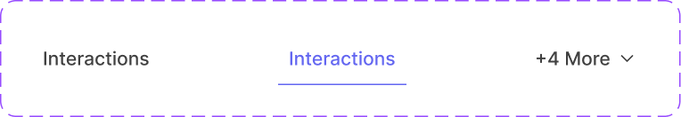
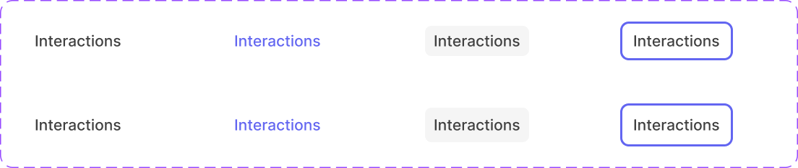

# Tab & Tab/Content

**Tab/Content** is the reusable label unit (icon + text + optional badge). **Tab** wraps it with tab-bar-specific chrome (the selected-state underline) — every `Tab` variant embeds a `Tab/Content` instance internally, so fixes to `Tab/Content`'s main component apply inside `Tab` too.

Figma: [`✅ Tab & Tab/Content`](https://www.figma.com/design/YFci6zgeYAQqX2OlHKQB0e) page. Tokens referenced below are defined in [`../DESIGN.md`](../DESIGN.md).

## Spec

Measured from Figma on 2026-10-07, then tidied with the design owner; Figma was updated to match. Where this section and the sections below disagree, this section is right.

Coded in [`components/src/navigation/Tabs.tsx`](../../../components/src/navigation/Tabs.tsx) (`Tabs`, `Tab`).

**`Tab`** (one tab in a tab bar)

| Part | Value |
|---|---|
| Tab | 40px high; the label area sits vertically centered in it; width hugs the label |
| Selected underline | `border-width/xs` (1px), `border/accent-indigo`, along the bottom edge of the 40px tab, as wide as the tab |
| Gap between tabs | `spacing/2` (8px) |
| "More" tab | a normal unselected tab whose label is e.g. "+4 More" with a 16px `icon/chevron-down` after it |

**`Tab/Content`** (the label area)

| Part | Value |
|---|---|
| Height | `Size=28px`: 28px · `Size=32px`: 32px |
| Padding | `spacing/2` (8px) left and right |
| Gap between icon and label | `spacing/1` (4px) |
| Label | `Body/Small-medium`, one line |
| Icons (optional prefix, suffix) | 16px, same color as the label |

| State | Fill | Label and icons |
|---|---|---|
| `Default` | none | `text + icon/secondary` |
| `Hover` | `bg/primary-hover`, `border-radii/rounded-6` | `text + icon/secondary` |
| `Selected` | none | `text + icon/accent-indigo` |
| `Focus` | as `Default`, plus the system-wide focus ring around the label area (`border-radii/rounded-8`) | |

## Tab/Content

| Part | Token(s) |
|---|---|
| Label — default | `text + icon/secondary`, `Body/Small-medium` |
| Label — selected | `text + icon/accent-indigo` |
| Hover background | `bg/primary-hover`, `border-radii/rounded-6` |
| Padding | `spacing/2` (8px) horizontal, `spacing/1` (4px) vertical |
| Icon/text gap | `spacing/1` (4px) |
| Prefix/suffix icon | Independently toggleable boolean slots, `INSTANCE_SWAP` |
| Badge | Boolean-toggleable, embeds a [Badge](chips-tag-badge.md) instance |

**Variants:** `State` = `Default` / `Selected` / `Hover` / `Focus`. `Size` = `28px` / `32px` (row height only — same padding/type scale either way).

## Tab

| Part | Token(s) |
|---|---|
| Selected underline — color | `border/accent-indigo` |
| Selected underline — weight | `border-width/xs` (1px) |
| Row gap | `spacing/2` (8px) |

**Variants:** `State` = `Default` / `Selected` / `Unselected` *(mislabeled, see Known gaps)`. `More` = `False` only (incomplete axis, see Known gaps).

## Behavior rules

- **`Tab` is for a horizontal tab bar** (adds the underline chrome); **`Tab/Content` alone** is for anywhere a similar label needs to live without tab-bar semantics (e.g. a segmented control, a filter pill row) — don't reach for the full `Tab` wrapper if there's no underline/tab-bar context.
- **The "+N More" overflow control is built as a `Tab` instance**, not a separate component — its content (icon, suffix chevron, "+N More" text) is entirely produced by overriding a `Tab/Content` instance's text and toggling its suffix icon. When a tab bar overflows, use this same pattern (a `Tab/Content` instance with overridden "+N More" text + chevron suffix) rather than inventing a new overflow treatment.
- **`Size=24px` vs `32px` follows the density of the surrounding UI**, same convention as other size-scaled components in this system — no content-based rule beyond that.

## Known gaps (component doesn't yet match spec, or naming is inconsistent)

- **Mislabeled variant:** `Tab`'s `State=Unselected` variant does not actually render an "unselected tab" — its embedded `Tab/Content` instance has its text overridden to "+4 More" and a chevron suffix icon added, making it the tab-bar's overflow/"more tabs" indicator, not a genuine unselected-tab state. (An unselected-but-visible tab is what `State=Default` already represents.) Flagging rather than renaming — same reasoning as prior mislabeled-variant findings, not done without confirmation given it's a global rename.
- **`Tab`'s `More` variant property has only one option (`False`)** — same "incomplete axis" pattern seen in Badge's `Weight` property. Not a bug, just unfinished; there's no way to distinguish "this Tab's More button is active" via variant today.
- Icon internals (chevron/icon vector strokes) are left unbound — same precedent as other components (no exact Foundation match).

## Changelog

- **2026-10-07:** added the Spec section. In Figma: `Tab/Content`'s `Size=24px` renamed `Size=28px` (it measures 28px); the selected underline bound to `border/accent-indigo` instead of a text token; two `State=Focus` variants added with the system-wide focus ring. First coded version added.
- **User fix (2026-08-18):** the selected-tab underline was 1.5px, which didn't match this system's only border-width primitive (`border-width/xs`, 1px). Changed to 1px and bound to `border-width/xs`, rather than leaving it unbound as a gap.
- Bound padding (previously raw `8`/`4`, unbound) → `spacing/2`/`spacing/1`, and gap (previously raw `8`/`4`, unbound) → `spacing/2`/`spacing/1` — across all 3 `Tab` variants and all 6 `Tab/Content` variants (48 individual bindings total).
- Verified colors and text styles were already fully and correctly bound on both components — no color-binding bugs found here.
- Verified visually before/after — no rendering changes.
- Documented anatomy, variants, and the Tab/Tab-Content relationship (including the "+N More" overflow pattern) — not previously written down.
