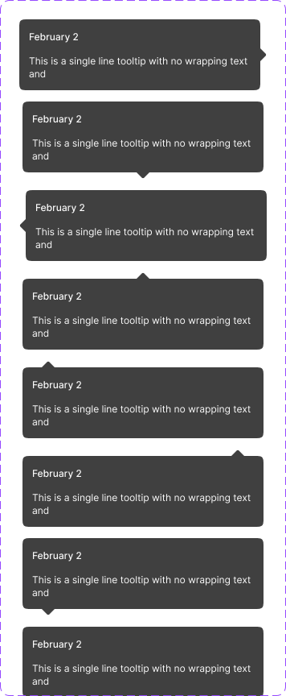

# Tooltip

A dark contextual-help bubble with a title, body text, and a directional pointer arrow.

Figma: [`✅ Tooltips`](https://www.figma.com/design/YFci6zgeYAQqX2OlHKQB0e) page. Tokens referenced below are defined in [`../DESIGN.md`](../DESIGN.md).

## Spec

Measured from Figma on 2026-10-06; Figma was tidied to match where noted in the Changelog. Where this section and the sections below disagree, this section is right.

Coded in [`components/src/tooltip/Tooltip.tsx`](../../../components/src/tooltip/Tooltip.tsx) — the bubble only; showing it and positioning it against its trigger is left to the app.

| Part | Value |
|---|---|
| Bubble | 300px wide, height hugs the content, `border-radii/rounded-6`, fill `bg/secondary-inverse`, padding `spacing/3` (12px), no border or shadow |
| Title | `Body/Mini-medium`, `text + icon/primary-inverse` |
| Body text | `Support/Caption`, `text + icon/primary-inverse`, wraps; `spacing/3` (12px) below the title |
| Pointer | a triangle 16px wide and 8px deep, `bg/secondary-inverse`, touching the bubble |

| `Pointer position` | Where the pointer sits |
|---|---|
| `Top left` / `Top right` | on the top edge, 24px in from that corner |
| `Top center` | centered on the top edge |
| `Bottom left` / `Bottom right` | on the bottom edge, 24px in from that corner |
| `Bottom center` | centered on the bottom edge |
| `Left` / `Right` | centered on that side |

## Anatomy

| Part | Token(s) |
|---|---|
| Bubble fill | `bg/secondary-inverse` |
| Bubble radius | `border-radii/rounded-6` |
| Bubble padding | `spacing/3` (12px) |
| Title | `text + icon/primary-inverse`, `Body/Mini-medium` |
| Body text | `text + icon/primary-inverse`, `Support/Caption` |
| Arrow inset (corner variants only) | `spacing/6` (24px) |

## Variants

`Pointer position` = `Right` / `Left` / `Top center` / `Bottom center` / `Top left` / `Top right` / `Bottom left` / `Bottom right`. 8 total, all built — every side plus both corners on the top and bottom edges.

## Behavior rules

- **`Pointer position` should point back at the element that triggered the tooltip** — choose the side/corner based on where the tooltip fits in the viewport relative to its trigger (e.g. `Top center` when the tooltip renders above a centered trigger, `Left` when the trigger is to the tooltip's right and space is tight above/below).
- **Body text wraps and grows the bubble's height** — there's no line clamp or truncation (`textTruncation: DISABLED`); a longer message just makes a taller bubble. Keep tooltip copy short regardless, since a very tall tooltip reads poorly as contextual help.
- **Title is optional in practice** even though every built variant includes one — a tooltip with just body text (no title) is a reasonable use for simpler hints; the title exists for cases that benefit from a short label above the explanation (e.g. a date, like the "February 2" placeholder shown here).

## Known gaps (component doesn't yet match spec, or naming is inconsistent)

None found beyond the fixed items below.

## Changelog

- **2026-10-06:** added the Spec section. No Figma changes were needed. First coded version (bubble only) added.
- Fixed both text layers (`Title`, `Text`) across all 8 variants — bound to completely foreign, unnamed styles (`Base/Small/Medium`, `Base/Small/Regular`, 12px Inter but with a non-standard 1.4 line-height) rather than this system's actual type scale. Rebound to `Body/Mini-medium` (title) and `Support/Caption` (body) — 16 text-style fixes total.
- Bound the arrow's inset padding (previously raw `24`, unbound) → `spacing/6`, on the 4 corner variants (`Top left`/`Top right`/`Bottom left`/`Bottom right`) that need it to offset the pointer from the bubble's rounded corner.
- Verified visually before/after — no rendering changes.
- Documented anatomy, variants, and behavior rules — not previously written down.
