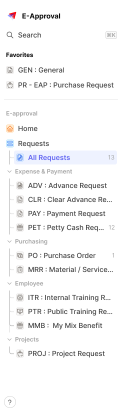

# Sidebar Navigation (pattern)

The primary desktop navigation rail for the E-Approval app — workspace switcher, search, and a grouped, collapsible list of request-type shortcuts.

Figma: [`📱 Navigation`](https://www.figma.com/design/YFci6zgeYAQqX2OlHKQB0e) page, `Sidebar Navigation` component set. Tokens referenced below are defined in [`../DESIGN.md`](../DESIGN.md).

## Why this is a "pattern" doc, not a "component" doc

Unlike [Avatar](../components/avatar.md) or [Button](../components/button.md), this isn't a single atom with a token-by-token anatomy table — it's an assembly of ~117 nested instances built from smaller pieces. A pattern doc describes **what it's built from, how those pieces are arranged, and what states the whole thing has** — not individual token bindings (those belong to whichever doc owns each underlying atom).

## Spec

Measured from the composed `Sidebar Navigation` instance (`Type=Expand`) on 2026-10-05. Where this section and the sections below disagree, this section is right.

**Container:** 244px wide, full height, no fill. Padding `spacing/4` (16px) top and bottom, `spacing/2` (8px) left and right, leaving a 228px content column. The help button is pinned to the bottom.

**Top to bottom:**

| # | Block | Spec |
|---|---|---|
| 1 | [Workspace menu](../components/nav-workspace-menu.md) | 28px row: 24px logo, `spacing/2` (8px) gap, "E-Approval" in `Body/Small-bold`, `text + icon/primary` |
| | *gap* | `spacing/2` (8px) |
| 2 | Search row | 28px row, `rounded-4`, padding 4px (2px right): 16px `icon/search`, `spacing/2` gap, "Search" in `Body/Small-medium`, `text + icon/secondary`; the [⌘K chip](../components/nav-shortcut-container.md) at the right edge (16px high, `bg/secondary`, `border/primary`, `rounded-4`) |
| | *gap* | `spacing/3` (12px) |
| 3 | Favorites | heading "Favorites" (`Body/Mini-bold`, `text + icon/primary`, no chevron), then [L1 items](../components/nav-item-l1.md) `spacing/0,5` (2px) apart |
| 4 | [Divider](../components/divider.md) | 1px, `border/primary-subtle`, with `spacing/3` (12px) above and below |
| 5 | Section label "E-approval" | `Body/Mini-semibold`, `text + icon/tertiary`, no chevron |
| 6 | Main menu | L1 items "Home" and "Requests", 2px apart. "Requests" is expanded into the tree below |
| 7 | Help button | 24px outline [Icon Button](../components/button.md), `rounded-infinite`, `bg/primary`, `border/primary`, bottom-left |

**The Requests tree** (rows touch, no gap between them):

- Each child row is 28px high and indented 11px. A 9px-wide connector (the [L2 Breadcrumb](../components/nav-item-l2.md): a 1px vertical line plus an elbow, in `border/primary` / `text + icon/tertiary`) sits to its left; the last child's line stops at the elbow.
- To the right of the connector is a full [L1-style row](../components/nav-item-l1.md) (icon chip + label), 206px wide — child rows have icon chips too.
- The first child is "All Requests", shown `Selected`, with the count "13" at the right.
- The other children are grouped under collapsible [Section labels](../components/nav-section-label.md) with a leading chevron, inside the same tree.

**Menu content in the reference** (labels truncate with an ellipsis at the column edge):

| Group | Items (icon chip color) |
|---|---|
| Favorites | GEN : General (Stone) · PR - EAP : Purchase Request (Stone) |
| E-approval | Home (Peach, `icon/home`) · Requests (Sky, `icon/layout-list`) |
| Requests → | All Requests (Ocean), count 13 |
| Requests → Expense & Payment | ADV : Advance Request · CLR : Clear Advance Re… · PAY : Payment Request · PET : Petty Cash Req… (count 12) |
| Requests → Purchasing | PO : Purchase Order (count 1) · MRR : Material / Service… |
| Requests → Employee | ITR : Internal Training R… · PTR : Public Training Re… · MMB : My Mix Benefit |
| Requests → Projects | PROJ : Project Request |

All request-type items use the Stone icon chip.

## Composition

Reuses components already documented elsewhere in the system:
- `IconButton/Icon Button` (Ghost style) — search shortcut trigger, row-level actions
- `Notification / Counter`, `icon_container`/icon-library instances — remote (external library), out of scope to rebind, see [Table](../components/table.md)'s precedent
- Icon-library instances (remote) for every item icon

Built from Navigation-specific atoms, now fully audited and documented on their own:
- [Workspace menu](../components/nav-workspace-menu.md) — the logo + workspace name row at top
- [Shortcut container](../components/nav-shortcut-container.md) — the "⌘K" search shortcut hint
- [Section Label](../components/nav-section-label.md) — the small caps group headers ("Favorites", "Expense & Payment", etc.)
- [Navigation item L1](../components/nav-item-l1.md) — a top-level row (icon + label + optional trailing badge/count)
- [Navigation Item L2 & L2 Breadcrumb](../components/nav-item-l2.md) — nested sub-items shown under an L1 item (e.g. "All request" under "Requests")
- [Unfoldable Navigation Item list](../components/nav-unfoldable-list.md) — the collapsible group wrapper combining an L1 parent with its L2 children

## Layout rules

- **`Type` = `Regular` (228px content column inside a 244px-wide container, expanded) / `Small` (40px, icon-only collapsed rail).** Small hides all labels/section headers and shows only the icon column — same items, same order, no separate content model.
- **Top-to-bottom structure:** Workspace switcher → Search → `Favorites` section (pinned shortcuts, no collapse) → one or more request-type sections, each with a `Section Label` and either a flat list of L1 items or an `Unfoldable Navigation Item list` wrapping L1+L2 items.
- **Root container:** `spacing/8` (32px) gap between major sections, `spacing/2`/`spacing/4` (8px/16px) outer padding.
- **"Soon" tag:** a pill-shaped chip (`border-radii/rounded-infinite`) marking not-yet-available nav items, `spacing/2` (8px) padding.

## States

- **Navigation item:** `Default` / `Selected` — selected shows a filled background + colored icon/label (seen on "All request" in the screenshot).
- **Unfoldable group:** `Collapsed` / `Extended`.
- **Workspace menu:** `Default` / `Hover` / `Loading`, `Type=App` / `Type=Settings`.

## Known gaps (component doesn't yet match spec, or naming is inconsistent)

- **Per-item icon accent color** (Peach/Sky/Ocean/Stone seen in the real usage screenshot) doesn't have a documented assignment rule — unclear if it's a deliberate categorization system (e.g. per request-type) or unstandardized per-item styling. Needs a decision from the design owner, not a guess.
- **`Shortcut contaienr`** is a real Figma component name with a typo — flagged in its own doc, not renamed without confirmation.
- A handful of deeper sub-atoms referenced by [Navigation item L1](../components/nav-item-l1.md) (`Sidebar icons`, `Badge`, `Badge noti`) weren't independently audited or documented in this pass — they were in scope only where a trivial fix was obvious (e.g. an unbound border-width). A full audit of those would be a further, separate pass.
- A few remaining foreign-token references trace into **remote (external library) icon instances** nested 3-4 levels deep (e.g. the search icon's vector stroke) — out of scope to rebind locally, same precedent as every other remote-component finding in this audit.

## Changelog

- **2026-10-05:** added the Spec section (measured container, block order, gaps, the Requests tree and the real menu content) after a trial build from this doc invented the menu structure and got text sizes and the count treatment wrong.
- **Full token audit (2026-08-19):** fixed foreign color tokens on the root composition (`Text/Secondary` → `text + icon/secondary` on the workspace name label copied into this frame, `Text/Light`/`Grays/35` → `text + icon/tertiary` on the "·" separator and "Soon" tag text, `Base/Medium` foreign text style → `Body/Small-medium` on the same three text layers) — same "Twenty library" contamination pattern found throughout the System Component audit.
- Bound 15+ previously-unbound `itemSpacing`/padding values across both `Type=Regular` and `Type=Small` variants (root gap 32px → `spacing/8`, section gaps 8-12px → `spacing/2`/`spacing/3`, etc.), and the "Soon" chip's oversized corner radius (`50`, a forced-pill hack) → `border-radii/rounded-infinite`, matching the same pattern seen in Avatar/Button/Radio button's circular elements.
- All 7 Navigation-specific sub-atoms this pattern depends on were audited, fixed, and documented for the first time in the same pass — see the Composition section above for links. This closes the gap flagged in the previous draft of this doc ("these sub-atoms don't have their own component doc yet").
- Verified visually before/after on both `Type=Regular` and `Type=Small` — screenshots are pixel-identical to the pre-fix baseline, confirming all binding changes were value-preserving.
- Initial draft (2026-08-19) — written as a demonstration of the pattern-doc format, before the full audit above was agreed and completed.
